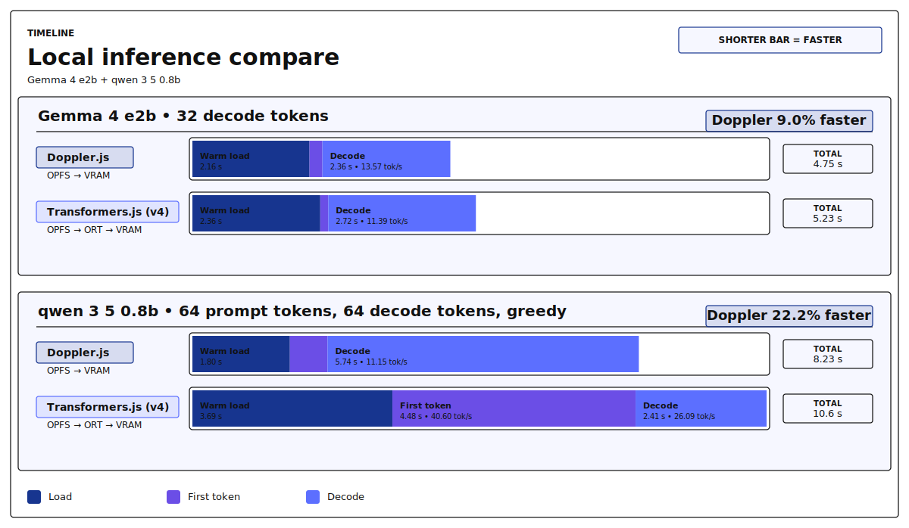
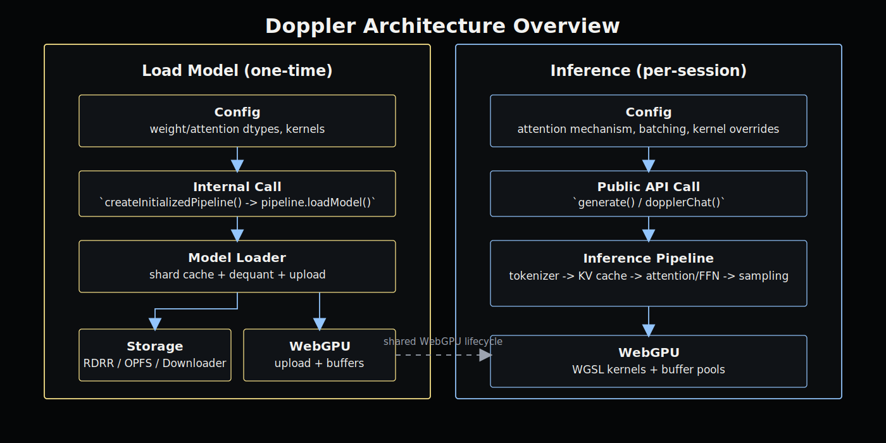

# Doppler.js

**D**eterministic **O**n-device **P**rocessing for **P**refill, **L**earning, and **E**xecution **R**untime

**[Try it live](https://d4da.com)**

Doppler is a local WebGPU runtime for browser, Node, and CLI intent/inference loops.
It provides explicit load-path and kernel-path control, reproducible phase benchmarks against Transformers.js (v4), and auditable kernel execution tracing.

## Evidence



This chart covers three 1B workloads (`g3-p032-d256-t0-k1`, `g3-p064-d064-t0-k1`, `g3-p064-d064-t1-k32`) under the same warm-opfs parity contract.
In this snapshot, Doppler leads first-response latency and decode throughput, while Transformers.js (v4) leads TTFT and prefill throughput.
Definitions and reproducibility details are in the Performance section.

## Local intent latency constraints

Intent pipelines are front-loaded: the first response determines perceived speed.
If load or TTFT drifts, the whole workflow feels delayed even when later decode is fast.
Browser-local inference keeps private prompt data local and makes control decisions resilient when connectivity is limited.
Doppler targets this critical path directly by making load mode, prefill, decode cadence, and kernel path explicit and tunable.

## Execution model: JavaScript + WGSL

Doppler keeps the runtime path thin and explicit.

Positioning:
- **vs WebLLM / TVM**: compiler-driven binaries can improve automation, but make shard-level composition, adapter hot-swap, and per-kernel inspection/tuning harder.
- **vs Transformers.js (v4) / ONNX Runtime**: Transformers.js (v4) runs through an ONNX graph/runtime layer; Doppler maps model + kernel path directly in config and exposes kernel-path tracing.

JS+WGSL advantages:
- **Control**: manifest-first contracts plus explicit kernel-path config keep execution choices auditable and reproducible.
- **Performance**: GPU compute dominates per-token latency, tensor ops stay on GPU, and readback is minimized to final logits.
- **Velocity**: handwritten WGSL kernels (human and/or coding agent) enable progressive fusion from debuggable atomic kernels to fused kernels without full model recompiles.

## Architecture comparison

```
Transformers.js                              Doppler
─────────────                                ───────
App (JS)                                     App (JS)
 └─ @huggingface/transformers (JS)            └─ Doppler runtime (JS)
     └─ onnxruntime-web (C++ → WASM)              └─ WebGPU
         └─ ONNX graph interpreter                     ├─ WGSL kernels (prewritten)
             └─ WebGPU                                 └─ RDRR weight shards
                 ├─ WGSL kernels (generated at
                 │   runtime from generic op library)
                 └─ ONNX weight shards
```

Transformers.js wraps a C++-to-WASM compiled ONNX runtime that interprets an exported graph and generates GPU shaders at runtime from a generic op library.
Models must be manually exported from PyTorch to ONNX format before they can run (maintained per-model by `onnx-community`).
Doppler is JS end-to-end with mostly prewritten WGSL kernels per operation (attention, RoPE, RMSNorm, FFN), with no graph interpreter and no WASM runtime layer in the inference path.
Some specialized paths still compile WGSL generated from templates/config at runtime (for example kernel tuning and router-specialized variants).
JSON manifests and runtime presets drive selection; JS orchestrates execution and WGSL remains deterministic math.
The RDRR format maps weight shards directly to GPU buffers, and conversion runs directly from SafeTensors or GGUF sources without an intermediate export step.
Architecture-specific patterns like sliding/full attention windows are runtime config in Doppler, as opposed to frozen in an exported graph.

## Runtime architecture and boundaries



See [`docs/architecture.md`](docs/architecture.md) for full subsystem and boundary details.

## Capability domains

### Artifact Domain

- Model conversion from SafeTensors/GGUF to RDRR (`convert`, Node surface).
- Manifest-first model contract with storage-backed and direct-source load paths.
- Artifact loading paths (`opfs`/`http`/`memory`) and shard/range/stream ingest behavior.
- `loadMode=memory` supports Node-only local filesystem source-runtime inputs (`.gguf` or SafeTensors directory), not remote URLs.

### Runtime Domain

- Local WebGPU runtime for browser and Node inference/compute.
- Kernel execution with explicit kernel-path selection and traceable runtime behavior.
- Runtime memory/buffer orchestration and GPU dispatch lifecycle.
- Training execution mechanics (step/runtime behavior) live here.

### Interface Domain

- Unified command surface: `convert`, `debug`, `bench`, `verify`.
- Supported suites: `kernels`, `inference`, `training`, `bench`, `debug`, `diffusion`, `energy`.
- `--surface auto` behavior: `convert` is forced to Node; other commands try Node first and only fall back to browser when configured Node-WebGPU fallback signatures match.
- Training flows block auto-downgrade and fail fast with explicit guidance.

### Assurance Domain

- Practical verify/calibrate workflows for inference, training, and distill stages.
- Contract-driven schema/field validation and fail-closed command behavior.
- Reproducible benchmark/reporting outputs via `--json`, `--capture-output`, and `bench --save --save-dir` (artifacts in `benchmarks/vendors/results/`).
- Hash-linked artifact lineage and provenance checks for claimable outputs.

### Details in docs

- Setup and day-1 workflows: [`docs/setup-instructions.md`](docs/setup-instructions.md)
- Architecture and boundaries: [`docs/architecture.md`](docs/architecture.md)
- RDRR and direct-source contract details: [`docs/formats.md`](docs/formats.md)
- Command contract/parity rules: [`src/tooling/command-api.js`](src/tooling/command-api.js)
- Benchmark policy and harness registry: [`benchmarks/vendors/README.md`](benchmarks/vendors/README.md)
- Testing workflows: [`docs/testing.md`](docs/testing.md)
- Training docs: [`docs/training-overview.md`](docs/training-overview.md), [`docs/training-artifact-policy.md`](docs/training-artifact-policy.md), [`docs/training-migrations.md`](docs/training-migrations.md)

### Output and tooling directories

- `tools/`: CLI entrypoints and engineering scripts.
- `benchmarks/`: benchmark registry, harness contracts, and benchmark fixtures/results policy.
- `reports/`: generated run outputs (gitignored); training artifacts are emitted to `reports/training/` by default.
- `bench/`: legacy output location; no active command defaults write here.

## Performance

### Snapshot table (1B, warm-opfs, parity)

Snapshot context: captured on 2026-03-01 on Apple M3 (Metal, macOS 26.1) with
`warm-opfs` load mode and parity decode profile.

| Workload              | Engine               | Model load (ms) | TTFT (ms) | First response (ms) | Prefill (tok/s) | Decode (tok/s) |
| --------------------- | -------------------- | --------------: | --------: | ------------------: | --------------: | -------------: |
| `g3-p064-d064-t0-k1`  | Doppler              |      **3172.4** |     568.9 |          **3739.7** |          324.12 |      **23.40** |
| `g3-p064-d064-t0-k1`  | Transformers.js (v4) |          4738.6 | **300.8** |              5053.4 |      **608.34** |          21.06 |
| `g3-p064-d064-t1-k32` | Doppler              |      **3184.7** |     675.7 |          **3860.4** |          323.65 |      **23.26** |
| `g3-p064-d064-t1-k32` | Transformers.js (v4) |          4417.0 | **317.6** |              4734.5 |      **577.39** |          20.92 |

In the two workloads shown above, Doppler is faster on first-response latency and decode throughput, while Transformers.js (v4) is faster on TTFT and prefill throughput.
Committed evidence:
- chart artifact: `benchmarks/vendors/results/compare_1b_multi-workload_favorable_phases.svg`
- committed compare fixture input: `benchmarks/vendors/fixtures/g3-p064-d064-t0-k1.compare.json`
Local/generated compare outputs are written to `benchmarks/vendors/results/*.json` and are gitignored by policy.

### Reproduce

```bash
for workload in g3-p064-d064-t0-k1 g3-p064-d064-t1-k32; do
  node tools/compare-engines.js \
    --mode compute \
    --load-mode opfs \
    --decode-profile parity \
    --tjs-version 4 \
    --model-id gemma-3-1b-it-wf16-ef16-hf16 \
    --tjs-model onnx-community/gemma-3-1b-it-ONNX-GQA \
    --workload "$workload" \
    --warmup 1 \
    --runs 3 \
    --seed 0 \
    --save \
    --save-dir benchmarks/vendors/results
done
```

## Getting started

See [`docs/setup-instructions.md`](docs/setup-instructions.md) for install, conversion, and run guides.
For contribution workflow, see [`docs/contributing.md`](docs/contributing.md).
For disclosure and community policies, see [`SECURITY.md`](SECURITY.md).

## Glossary

- **TTFT**: time-to-first-token from generation start.
- **First response**: `modelLoadMs + firstTokenMs`.
- **OPFS**: Origin Private File System browser storage used for persistent local model artifacts.
- **RDRR**: Doppler model artifact format used by loader/runtime contracts.
- **Parity profile**: one-token decode cadence used for cross-engine comparison.
- **Warm-opfs**: warm cache mode with OPFS local load path.

## Inspiration

- [WebLLM](https://github.com/mlc-ai/web-llm) - High-performance in-browser LLM inference
- [PyTorch](https://pytorch.org/) - Machine learning framework
- [WebGPU](https://www.w3.org/TR/webgpu/) - W3C GPU API specification
- [Mistral 7B](https://arxiv.org/abs/2310.06825) - Sliding window attention, grouped-query attention
- [Mixtral of Experts](https://arxiv.org/abs/2401.04088) - Sparse Mixture of Experts architecture
- [DeepSeekMoE](https://arxiv.org/abs/2401.06066) - Expert specialization in MoE
- [DeepSeek-V3](https://arxiv.org/abs/2412.19437) - Multi-head Latent Attention, 671B MoE
- [Kimi K2](https://arxiv.org/abs/2507.20534) - 1T parameter MoE, agentic intelligence
- [Dr. Doppler](https://megaman.fandom.com/wiki/Dr._Doppler) - Mega Man X3

## License

Apache License 2.0 (`Apache-2.0`). See [LICENSE](LICENSE) and [NOTICE](NOTICE).

## Trademarks

Trademark usage for the names "Doppler" and "Doppler.js" is described in
[BRANDING.md](BRANDING.md).
