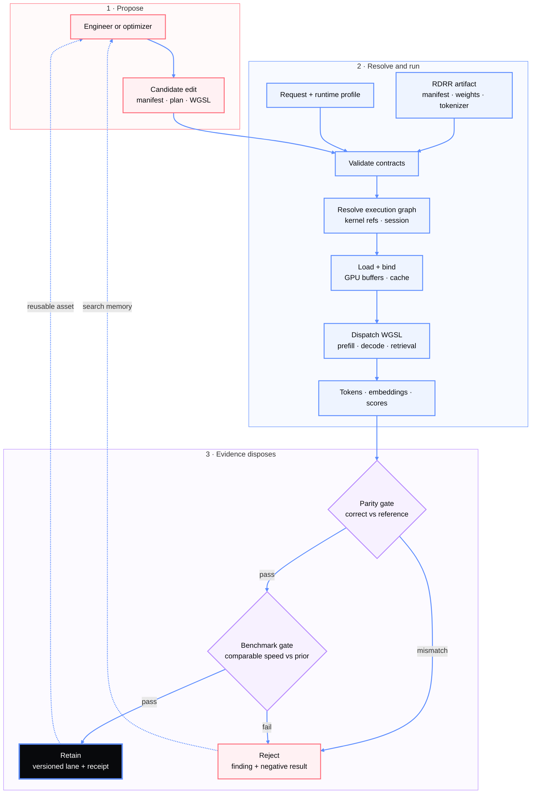

# doppler-gpu

[](https://github.com/clocksmith/doppler/actions/workflows/check-green.yml)
[](https://www.npmjs.com/package/doppler-gpu)
[](https://github.com/clocksmith/doppler/blob/main/LICENSE)
[](https://github.com/clocksmith/doppler/pulls)

Doppler turns inference engineering into a verifiable search problem. Optimizers
edit JSON manifests, execution plans, and WGSL kernels; parity and benchmark gates
accept or reject each candidate against correctness and speed.

These contracts and gates are used by operators to tune a configurable and pure JavaScript and WGSL sourced WebGPU
runtime for supported
[RDRR artifacts](https://github.com/clocksmith/doppler/blob/main/docs/rdrr-format.md)
in browser, Node, and Bun. Doppler runs text generation, embeddings, and reranking
locally, with CLI and OpenAI-compatible server entry points. 

**Read this first:** [getting started](https://github.com/clocksmith/doppler/blob/main/docs/getting-started.md) → [Root API](https://github.com/clocksmith/doppler/blob/main/docs/api/root.md) → [open source evidence](https://github.com/clocksmith/doppler/blob/main/docs/model-competition-scoreboard.md)

**[Try the live demo](https://d4da.com/doppler)** | **[npm](https://www.npmjs.com/package/doppler-gpu)** | **[docs](https://github.com/clocksmith/doppler/blob/main/docs/INDEX.md)**

```bash
npx doppler-gpu
```

<!-- model-type-clusters:start -->

## Supported RDRR model types

Doppler classifies artifacts by what they consume and produce. This is
separate from lineage (`family`), runtime implementation (`modelType`), and
artifact-size tier.

| Type | Verified / Cataloged | What it does |
| --- | --- | --- |
| Text generators | 12 / 14 | `text → text` |
| Multimodal generators | 3 / 3 | `audio + image + text → text` |
| Diffusion language models | 0 / 1 | `text → text` |
| Translation specialists | 2 / 2 | `text → text` |
| Language embedders | 2 / 2 | `text → embedding` |
| Rerankers | 2 / 2 | `text-pair → relevance-score` |
| Protein encoders | 3 / 3 | `sequence → embedding + token outputs` |
| Nucleotide encoders | 1 / 1 | `dna-seq → embedding` |

The [full model-support matrix](https://github.com/clocksmith/doppler/blob/main/docs/model-support-matrix.md)
lists every lane and its lifecycle evidence. Classification says what an
artifact is shaped to do; only lifecycle receipts establish what is
verified, and a runtime pass does not by itself qualify every declared input
modality.

<!-- model-type-clusters:end -->

## LoRA: runtime loading and training

Doppler supports:

- SafeTensors LoRA loading and hot-swap at runtime.
- Experimental SFT/LoRA training in Node, Bun, and browser via `doppler-gpu/training`.
- Native packed-Q4K LoRA for `qwen-3-5-0-8b-q4k-ehaf16` in `webgpu_native` (frozen base, LoRA A/B updates only).
- External backends for other packed-Q4K training targets.

```bash
npx doppler-gpu lora --config ./workload.json --surface node
```

Active adapters are registered in [models/adapters/catalog.json](models/adapters/catalog.json).
The training API, workload schema, and adapter families live in the
[LoRA Format specification](docs/lora-format.md),
[Training handbook](docs/training-handbook.md), and [Training API](docs/api/training.md).

## Evidence

Doppler has higher throughput than Transformers.js in accepted,
throughput-comparable browser WebGPU comparisons indexed below where the
throughput gate passes.


Text uses tok/s, embeddings use embedding/s, and reranking uses rerank/s;
higher is faster. Every comparison passes its declared workload
correctness gate. Model loading is separate: Transformers.js loads the Vulkan
embedding and reranker artifacts faster. The
[competition scoreboard](https://github.com/clocksmith/doppler/blob/main/docs/model-competition-scoreboard.md) links every
receipt, and the [methodology](https://github.com/clocksmith/doppler/blob/main/docs/benchmark-methodology.md) defines the gates.

## Why these lanes are faster

Doppler speedups come from specific, explicit runtime changes:

- **Fusion:** projection + FFN path reductions reduce kernel count.
- **Attention/layout tuning:** lowers prefill overhead.
- **Batched decode:** amortizes readback overhead.
- **Packed kernels:** Q4_K + INT4-PLE reduce projection traffic.

Evidence receipts:

- [Qwen 3.5 0.8B (Metal)](https://github.com/clocksmith/doppler/blob/main/benchmarks/vendors/results/compare_20260709T154633.json)
- [Qwen embedding + rerank](https://github.com/clocksmith/doppler/blob/main/benchmarks/vendors/results/embedding_compare_qwen-3-embedding-0-6b-q4k-ehf16-af32_20260709T180853.json), [Qwen rerank](https://github.com/clocksmith/doppler/blob/main/benchmarks/vendors/results/rerank_compare_qwen-3-reranker-0-6b-q4k-ehf16-af32_20260709T192830.json)
- [Qwen 3.5 2B (Vulkan)](https://github.com/clocksmith/doppler/blob/main/benchmarks/vendors/results/compare_20260707T161623.json)
- [Gemma 4 (Vulkan)](https://github.com/clocksmith/doppler/blob/main/benchmarks/vendors/results/compare_20260707T170557.json)

Retention is gated: a lane moves forward only when both parity and benchmark
receipts pass in the
[challenger framework](https://github.com/clocksmith/doppler/blob/main/docs/local-gpu-challenger-framework.md).

### Long-term direction

Humans run this loop today. WGSL-distillation is experimental.
Automation in kernel generation/autotuning is a roadmap item, not shipped yet.
New checkpoints and GPUs still go through the same parity and benchmark gate flow.

## How it works



The full resolve, load, bind, dispatch, and readback flow lives in the
[architecture](https://github.com/clocksmith/doppler/blob/main/docs/architecture.md)
document. Unsupported paths fail closed. Doppler owns artifact and execution
contracts; applications own policy.

New model families need RDRR conversion and may need tokenizer, graph, or kernel
support.

[Ouroboros/Reploid](https://github.com/clocksmith/doppler/blob/main/docs/architecture.md#optional-ouroborosreploid-integration)
keeps orchestration above this boundary.
[Program Bundles](https://github.com/clocksmith/doppler/blob/main/docs/integration/program-bundle.md)
preserve program identity for downstream backends.

## Quick start

### Browser

The live demo runs locally and works offline after its first model download.

### CLI

```bash
npx doppler-gpu "Summarize WebGPU in one sentence"
npx doppler-gpu --model qwen3-0.8b --prompt "Write a haiku about GPUs"
npx doppler-gpu --list-models
```

### Root API

The `dr` facade is the primary app API. Advanced APIs use package subpaths.

```js
import { dr } from 'doppler-gpu';

// Stream tokens
const model = await dr.load('qwen3-0.8b');
for await (const token of model.generate('Describe WebGPU briefly')) {
  process.stdout.write(token);
}

// One-shot
const text = await model.generateText('Explain WebGPU in one sentence');
```

### OpenAI-compatible server

```bash
npx doppler-serve --model qwen3-0.8b --port 8080
```

Point an OpenAI client at `http://localhost:8080/v1`:

```js
import OpenAI from 'openai';
const client = new OpenAI({ baseURL: 'http://localhost:8080/v1', apiKey: 'unused' });
const response = await client.chat.completions.create({
  model: 'qwen3-0.8b',
  messages: [{ role: 'user', content: 'Hello' }],
});
```

Registry IDs resolve to hosted RDRR artifacts from `clocksmith/rdrr` by default. See the [Root API guide](https://github.com/clocksmith/doppler/blob/main/docs/api/root.md).

## Start here

### Pick a path

- **Application builders:** start with [getting started](https://github.com/clocksmith/doppler/blob/main/docs/getting-started.md), [Root API](https://github.com/clocksmith/doppler/blob/main/docs/api/root.md), and the [OpenAI-compatible server](#openai-compatible-server).
- **Integrators:** use the [RDRR format](https://github.com/clocksmith/doppler/blob/main/docs/rdrr-format.md), [support matrix](https://github.com/clocksmith/doppler/blob/main/docs/model-support-matrix.md), and [Program Bundles](https://github.com/clocksmith/doppler/blob/main/docs/integration/program-bundle.md).
- **Kernel/inference engineers:** follow [architecture](https://github.com/clocksmith/doppler/blob/main/docs/architecture.md), [performance optimization](https://github.com/clocksmith/doppler/blob/main/docs/developer-guides/16-kernel-performance-optimization.md), and the [challenger framework](https://github.com/clocksmith/doppler/blob/main/docs/local-gpu-challenger-framework.md).
- **Evidence reviewers:** review the [scoreboard](https://github.com/clocksmith/doppler/blob/main/docs/model-competition-scoreboard.md), [methodology](https://github.com/clocksmith/doppler/blob/main/docs/benchmark-methodology.md), and [release matrix](https://github.com/clocksmith/doppler/blob/main/docs/release-matrix.md).

The [docs index](https://github.com/clocksmith/doppler/blob/main/docs/INDEX.md)
owns the complete model, subsystem, API, architecture, and operator inventory.

## Environment requirements

WebGPU is required. Use a current Chromium browser; Node installs the `webgpu`
provider as an optional dependency.

## License

Apache License 2.0 (`Apache-2.0`). See [LICENSE](LICENSE) and [NOTICE](NOTICE).
