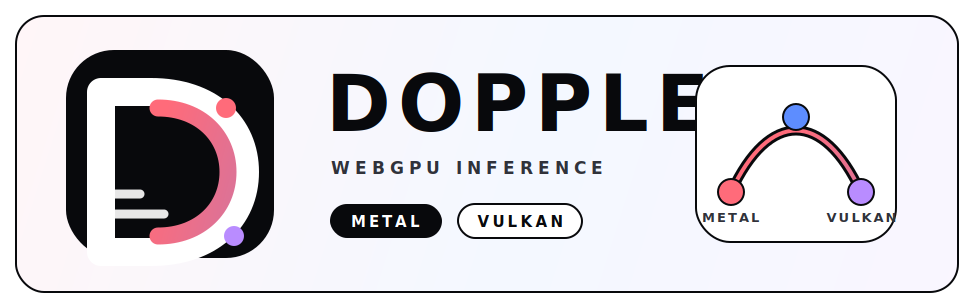

# doppler-gpu



Browser-native inference on raw WebGPU. Pure JS + WGSL.

**[Try the live demo](https://d4da.com/doppler)** | **[npm](https://www.npmjs.com/package/doppler-gpu)** | **[docs](https://github.com/clocksmith/doppler/blob/main/docs/INDEX.md)**

[](https://github.com/clocksmith/doppler/blob/main/docs/benchmark-methodology.md)

Gemma 4 E2B on Apple M3 browser (2026-04-15). Cold load: Doppler 2.5× faster
(17.0s vs 57.5s). Warm E2E: Transformers.js 40% faster (6.7s vs 11.2s) —
better TTFT (~210ms vs ~1143ms) and decode (~29 tok/s vs ~11 tok/s). Warm model
load is tied (~4.4s). This is a product-engine comparison across different
artifact formats, not a format-identical kernel benchmark. Receipt:
[`compare_20260415T170108.json`](./benchmarks/vendors/results/compare_20260415T170108.json).

Broader model status and the surrounding compare evidence live in the support
and release matrices. See the
[benchmark methodology](https://github.com/clocksmith/doppler/blob/main/docs/benchmark-methodology.md)
for the receipt contract and disclosure rules.

## New in 0.4.2

- `Gemma 4 E2B` support for Doppler-native `RDRR` artifacts and direct-source `TFLite` / LiteRT workflows.
- Experimental direct-source loading for `TFLite`, `GGUF`, and `SafeTensors`, alongside native `RDRR` artifacts.

## Quick start

### Browser

Use the live demo link above — it runs entirely in the browser with no server required. Models load into the browser cache and work offline after first download.

### CLI

```bash
npx doppler-gpu
```

Downloads the default quickstart model, runs a local prompt, and prints the answer.
Node quickstart artifacts are cached in `~/.cache/doppler-gpu/models` after the
first run; set `DOPPLER_QUICKSTART_CACHE_DIR` to move the cache or
`DOPPLER_QUICKSTART_CACHE=0` to disable it.

```bash
npx doppler-gpu "Summarize WebGPU in one sentence"
npx doppler-gpu --model qwen3-0.8b --prompt "Write a haiku about GPUs"
npx doppler-gpu --list-models
```

### Root API

The `doppler` facade is the primary app-facing API.
The root package intentionally stays small: it exports `doppler` and `DOPPLER_VERSION`.
Advanced surfaces now live on explicit subpaths such as `doppler-gpu/loaders`,
`doppler-gpu/generation`, `doppler-gpu/tooling`, and `doppler-gpu/orchestration`.
Support tiers for those subpaths are tracked in the subsystem support matrix rather
than assumed from export shape alone.

```js
import { doppler } from 'doppler-gpu';

// Stream tokens
const model = await doppler.load('gemma3-270m');
for await (const token of model.generate('Describe WebGPU briefly')) {
  process.stdout.write(token);
}

// One-shot
const text = await model.generateText('Explain WebGPU in one sentence');
```

### OpenAI-compatible server

For existing apps, SDKs, and eval stacks that speak the OpenAI protocol:

```bash
npx doppler-serve --model gemma3-270m --port 8080
```

Then point any OpenAI client at `http://localhost:8080/v1`:

```js
import OpenAI from 'openai';
const client = new OpenAI({ baseURL: 'http://localhost:8080/v1', apiKey: 'unused' });
const response = await client.chat.completions.create({
  model: 'gemma3-270m',
  messages: [{ role: 'user', content: 'Hello' }],
});
```

This is a compatibility bridge — the core engine runs identically in the browser or Node.

Registry IDs resolve to hosted RDRR artifacts from `Clocksmith/rdrr` by default. See the [Root API guide](https://github.com/clocksmith/doppler/blob/main/docs/api/root.md).

## Support contract

Doppler keeps model support and subsystem support separate:

- [model support matrix](https://github.com/clocksmith/doppler/blob/main/docs/model-support-matrix.md): which models are verified right now
- [subsystem support matrix](https://github.com/clocksmith/doppler/blob/main/docs/subsystem-support-matrix.md): which runtime and API surfaces are `tier1`, `experimental`, or `internal-only`

The tier1 proof surface is the hosted browser demo, the root `doppler` API, the quickstart CLI, the OpenAI-compatible localhost server, and the verified text-inference path behind them.

## Why Doppler

**Browser-native.** Runs in a WebGPU browser tab with OPFS caching, so models stay available offline after the first load.

**JavaScript-first execution.** JSON resolves policy, JavaScript handles orchestration, and WGSL kernels handle compute. Kernel paths, dtype choices, and runtime behavior stay visible in the shipped source.

**Fast iteration.** JS, WGSL, and JSON changes run directly through the same stack used by the browser and Node surfaces, which keeps debugging and profiling close to real runtime behavior.

**`for await` streaming.** Generation uses a native `AsyncGenerator` that fits normal app control flow.

**LoRA hot-swap.** Experimental advanced surface for swapping adapters at runtime without reloading the base model.

**Independent model instances.** Run multiple models concurrently. Each owns its pipeline, buffers, and KV cache.

## Quickstart-supported models

All models below are verified with deterministic greedy decoding on WebGPU hardware.
These registry IDs resolve to hosted RDRR artifacts automatically from the browser demo,
`npx doppler-gpu`, or `doppler.load(...)`.

| Model | Registry ID | Quant | Size | Family |
| --- | --- | --- | --- | --- |
| Gemma 3 270M IT | `gemma3-270m` | Q4K | 270M | Gemma |
| Gemma 3 1B IT | `gemma3-1b` | Q4K | 1B | Gemma |
| Gemma 4 E2B IT | `gemma4-e2b` | Q4K | E2B | Gemma |
| EmbeddingGemma 300M | `embeddinggemma-300m` | Q4K | 300M | Gemma |
| Qwen 3.5 0.8B | `qwen3-0.8b` | Q4K | 0.8B | Qwen |
| Qwen 3.5 2B | `qwen3-2b` | Q4K | 2B | Qwen |

Additional verified local-artifact models (TranslateGemma 4B, LFM2.5 1.2B) are
available outside the quickstart registry, including Gemma 4 E2B INT4PLE.
Conversion configs exist for Gemma 4 MoE, Janus, and Sana but are not yet in the
quickstart registry.
See the
[model support matrix](https://github.com/clocksmith/doppler/blob/main/docs/model-support-matrix.md).
Subsystem support tiers for direct-source inputs, advanced subpaths, diffusion,
energy, and training live in the
[subsystem support matrix](https://github.com/clocksmith/doppler/blob/main/docs/subsystem-support-matrix.md).

## Under the hood

- Sharded weight loading via OPFS moves multi-GB weights into VRAM without blocking the main thread.
- Quantized inference (Q4K, F16) runs practical model sizes on consumer GPUs.
- TurboQuant KV-cache profiles are available for quantized decode-cache runs.
- Kernel hot-swap between prefill and decode paths with zero graph recompilation.
- Config-driven runtime with explicit profiles, kernel-path selection, and sampling.

## Documentation

- npm quickstart: run `npx doppler-gpu --help`
- Docs index (canonical navigation): [docs/INDEX.md](https://github.com/clocksmith/doppler/blob/main/docs/INDEX.md)
- First-run workflow: [docs/getting-started.md](https://github.com/clocksmith/doppler/blob/main/docs/getting-started.md)
- CLI reference: [docs/cli.md](https://github.com/clocksmith/doppler/blob/main/docs/cli.md)
- Runtime config contract: [docs/config.md](https://github.com/clocksmith/doppler/blob/main/docs/config.md)
- Architecture: [docs/architecture.md](https://github.com/clocksmith/doppler/blob/main/docs/architecture.md)
- Model support matrix: [docs/model-support-matrix.md](https://github.com/clocksmith/doppler/blob/main/docs/model-support-matrix.md)

## Environment requirements

- WebGPU is required.
- **Browser**: Current Chromium browsers with WebGPU enabled, including Chrome and Edge.
  WebGPU shipped in Chrome/Edge 113+. Firefox and Safari support varies.
- **Node**: Requires a WebGPU provider (`webgpu` npm package). Installed automatically as an optional dependency.

## License

Apache License 2.0 (`Apache-2.0`). See [LICENSE](LICENSE) and [NOTICE](NOTICE).
