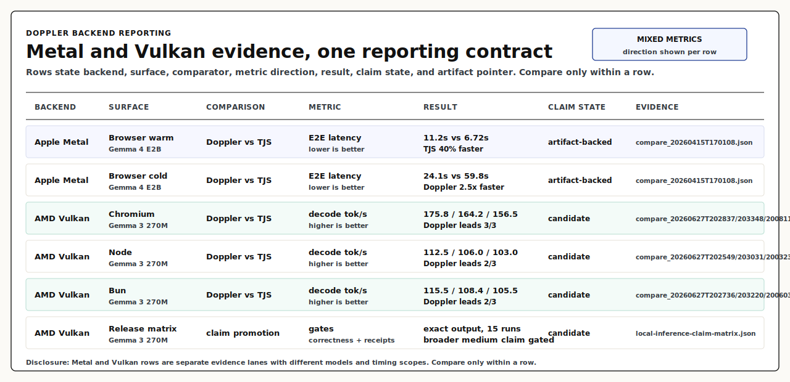

# doppler-gpu

Browser-native inference on raw WebGPU. Pure JS + WGSL.

**[Try the live demo](https://d4da.com/doppler)** | **[npm](https://www.npmjs.com/package/doppler-gpu)** | **[docs](https://github.com/clocksmith/doppler/blob/main/docs/INDEX.md)**
Broader model status and compare evidence live in the support and release
matrices. See the
[benchmark methodology](https://github.com/clocksmith/doppler/blob/main/docs/benchmark-methodology.md)
for the receipt contract and disclosure rules.

## What it is

- A WebGPU inference engine written in JavaScript and WGSL.
- A shared browser, Node, Bun, CLI, and OpenAI-compatible server surface.
- An RDRR model loader for sharded weights, manifest-owned config, and tokenizer
  metadata.
- A runtime that keeps kernel paths, dtype policy, and benchmark contracts
  visible in JSON, JavaScript, and WGSL.

## How it works

1. A registry ID or model URL resolves to an RDRR manifest and weight shards.
2. The manifest owns model parameters, tokenizer metadata, session policy, and
   execution graph.
3. The loader caches shards in OPFS or disk and uploads weights to WebGPU
   buffers.
4. JavaScript orchestrates prefill, decode, KV cache, and streaming.
5. WGSL kernels run the tensor work selected by the manifest and runtime config.

## Quick start

### Browser

Use the live demo link above — it runs entirely in the browser with no server required. Models load into the browser cache and work offline after first download.

### CLI

```bash
npx doppler-gpu
```

Downloads the default quickstart model, runs a local prompt, and prints the answer.
Node quickstart artifacts are cached in `~/.cache/doppler-gpu/models` after the
first run; set `DOPPLER_QUICKSTART_CACHE_DIR` to move the cache or
`DOPPLER_QUICKSTART_CACHE=0` to disable it.

```bash
npx doppler-gpu "Summarize WebGPU in one sentence"
npx doppler-gpu --model gemma3-270m --prompt "Write a haiku about GPUs"
npx doppler-gpu --list-models
```

### Root API

The `doppler` facade is the primary app-facing API.
The root package intentionally stays small: it exports `doppler` and `DOPPLER_VERSION`.
Advanced surfaces now live on explicit subpaths such as `doppler-gpu/loaders`,
`doppler-gpu/generation`, `doppler-gpu/tooling`, and `doppler-gpu/orchestration`.
Support tiers for those subpaths are tracked in the subsystem support matrix rather
than assumed from export shape alone.

```js
import { doppler } from 'doppler-gpu';

// Stream tokens
const model = await doppler.load('gemma3-270m');
for await (const token of model.generate('Describe WebGPU briefly')) {
  process.stdout.write(token);
}

// One-shot
const text = await model.generateText('Explain WebGPU in one sentence');
```

### OpenAI-compatible server

For existing apps, SDKs, and eval stacks that speak the OpenAI protocol:

```bash
npx doppler-serve --model gemma3-270m --port 8080
```

Then point any OpenAI client at `http://localhost:8080/v1`:

```js
import OpenAI from 'openai';
const client = new OpenAI({ baseURL: 'http://localhost:8080/v1', apiKey: 'unused' });
const response = await client.chat.completions.create({
  model: 'gemma3-270m',
  messages: [{ role: 'user', content: 'Hello' }],
});
```

This is a compatibility bridge — the core engine runs identically in the browser or Node.

Registry IDs resolve to hosted RDRR artifacts from `Clocksmith/rdrr` by default. See the [Root API guide](https://github.com/clocksmith/doppler/blob/main/docs/api/root.md).

## Support contract

Doppler keeps model support and subsystem support separate:

- [model support matrix](https://github.com/clocksmith/doppler/blob/main/docs/model-support-matrix.md): which models are verified right now
- [subsystem support matrix](https://github.com/clocksmith/doppler/blob/main/docs/subsystem-support-matrix.md): which runtime and API surfaces are `tier1`, `experimental`, or `internal-only`

The tier1 proof surface is the hosted browser demo, the root `doppler` API, the quickstart CLI, the OpenAI-compatible localhost server, and the verified text-inference path behind them.

## Benchmark evidence

The release matrix lists checked benchmark fixtures with hardware and backend,
including Apple Metal and AMD Vulkan rows. The README chart uses one reporting
contract across backends: each row states backend, surface, comparator, metric
direction, result, claim state, and evidence path. Metal and Vulkan rows are
separate evidence lanes and should only be compared within a row.



## Quickstart-supported models

All models below have verified WebGPU quickstart evidence. Text-generation
models use deterministic greedy decoding; EmbeddingGemma uses the embedding
verification contract.
These registry IDs resolve to hosted RDRR artifacts automatically from the browser demo,
`npx doppler-gpu`, or `doppler.load(...)`.

| Model | Registry ID | Quant | Size | Family |
| --- | --- | --- | --- | --- |
| Gemma 3 270M IT | `gemma3-270m` | Q4K | 270M | Gemma |
| Gemma 3 1B IT | `gemma3-1b` | Q4K | 1B | Gemma |
| Gemma 4 E2B IT | `gemma4-e2b` | Q4K | E2B | Gemma |
| Gemma 4 E2B IT INT4PLE | `gemma4-e2b-int4ple` | Q4K | E2B | Gemma |
| EmbeddingGemma 300M | `embeddinggemma-300m` | Q4K | 300M | Gemma |

Additional local-artifact models, including TranslateGemma 4B and Qwen 3.5
lanes, are tracked outside the quickstart registry.
Conversion configs exist for Gemma 4 MoE and Janus but are not yet in the
quickstart registry.
See the
[model support matrix](https://github.com/clocksmith/doppler/blob/main/docs/model-support-matrix.md).
Subsystem support tiers for direct-source inputs, advanced subpaths, diffusion,
energy, and training live in the
[subsystem support matrix](https://github.com/clocksmith/doppler/blob/main/docs/subsystem-support-matrix.md).

## Documentation

- npm quickstart: run `npx doppler-gpu --help`
- Docs index (canonical navigation): [docs/INDEX.md](https://github.com/clocksmith/doppler/blob/main/docs/INDEX.md)
- First-run workflow: [docs/getting-started.md](https://github.com/clocksmith/doppler/blob/main/docs/getting-started.md)
- CLI reference: [docs/cli.md](https://github.com/clocksmith/doppler/blob/main/docs/cli.md)
- Runtime config contract: [docs/config.md](https://github.com/clocksmith/doppler/blob/main/docs/config.md)
- Architecture: [docs/architecture.md](https://github.com/clocksmith/doppler/blob/main/docs/architecture.md)
- Model support matrix: [docs/model-support-matrix.md](https://github.com/clocksmith/doppler/blob/main/docs/model-support-matrix.md)

## Environment requirements

- WebGPU is required.
- **Browser**: Current Chromium browsers with WebGPU enabled, including Chrome and Edge.
  WebGPU shipped in Chrome/Edge 113+. Firefox and Safari support varies.
- **Node**: Requires a WebGPU provider (`webgpu` npm package). Installed automatically as an optional dependency.

## License

Apache License 2.0 (`Apache-2.0`). See [LICENSE](LICENSE) and [NOTICE](NOTICE).
