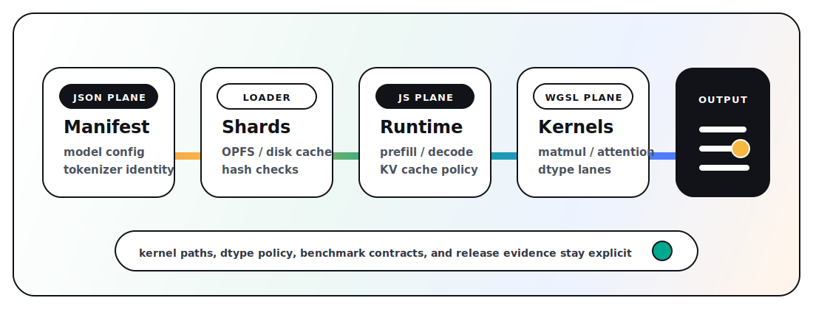

# doppler-gpu

JavaScript and WGSL WebGPU inference for browser and Node, with CLI and
OpenAI-compatible local server entry points. Doppler loads sharded
[RDRR model artifacts](./docs/rdrr-format.md) for text generation, embeddings,
and reranking. Bun WebGPU support is experimental.

**[Try the live demo](https://d4da.com/doppler)** | **[npm](https://www.npmjs.com/package/doppler-gpu)** | **[docs](https://github.com/clocksmith/doppler/blob/main/docs/INDEX.md)**

## Current evidence

The current Tier 1 receipts are claim-grade, release-claimable browser WebGPU
comparisons against Transformers.js on Apple M3 Metal. Each receipt passes its
correctness, comparable-surface, pinned-comparator, and hosted-artifact gates.

| Lane | Correctness | Workload | Doppler | Transformers.js | Result | Receipt |
| --- | --- | --- | ---: | ---: | ---: | --- |
| Qwen 3.5 0.8B text | Exact output match | p512-d128-t0-k1 | 38.42 tok/s | 26.54 tok/s | Doppler wins, 1.45x | [receipt](./benchmarks/vendors/results/compare_20260709T154633.json) |
| Qwen 3 Embedding 0.6B | Semantic pass | Embedding fixture | 22.83 emb/s | 19.38 emb/s | Doppler wins, 1.18x | [receipt](./benchmarks/vendors/results/embedding_compare_qwen-3-embedding-0-6b-q4k-ehf16-af32_20260709T180853.json) |
| Qwen 3 Reranker 0.6B | Semantic pass, expected top document | 3-document rerank | 2.14 reranks/s | 2.05 reranks/s | Doppler wins, 1.05x | [receipt](./benchmarks/vendors/results/rerank_compare_qwen-3-reranker-0-6b-q4k-ehf16-af32_20260709T192830.json) |

These are disclosed product-format comparisons: Doppler runs RDRR artifacts and
Transformers.js runs ONNX artifacts. AMD Vulkan, Tier 2, latency, load-time, and
additional hardware results remain separate in the
[release matrix](https://github.com/clocksmith/doppler/blob/main/docs/release-matrix.md).
See the
[benchmark methodology](https://github.com/clocksmith/doppler/blob/main/docs/benchmark-methodology.md)
for metric and fairness contracts.

## How it works



1. A registry ID or model URL resolves to an RDRR manifest and weight shards.
2. The manifest owns model parameters, tokenizer metadata, session policy, and
   execution graph.
3. The loader caches shards in OPFS or disk and uploads weights to WebGPU
   buffers.
4. JavaScript orchestrates prefill, decode, KV cache, and streaming.
5. WGSL kernels run the tensor work selected by the manifest and runtime config.

## Quick start

### Browser

Use the live demo link above. It runs entirely in the browser with no server
required. Models load into the browser cache and work offline after the first
download.

### CLI

```bash
npx doppler-gpu
```

Downloads the default quickstart model, runs a local prompt, and prints the answer.
Node quickstart artifacts are cached in `~/.cache/doppler-gpu/models` after the
first run; set `DOPPLER_QUICKSTART_CACHE_DIR` to move the cache or
`DOPPLER_QUICKSTART_CACHE=0` to disable it.

```bash
npx doppler-gpu "Summarize WebGPU in one sentence"
npx doppler-gpu --model qwen3-0.8b --prompt "Write a haiku about GPUs"
npx doppler-gpu --list-models
```

### Root API

The `dr` facade is the primary app-facing API. `doppler` remains a compatibility
alias. Advanced APIs live on explicit package subpaths.

```js
import { dr } from 'doppler-gpu';

// Stream tokens
const model = await dr.load('qwen3-0.8b');
for await (const token of model.generate('Describe WebGPU briefly')) {
  process.stdout.write(token);
}

// One-shot
const text = await model.generateText('Explain WebGPU in one sentence');
```

### OpenAI-compatible server

For existing apps, SDKs, and eval stacks that speak the OpenAI protocol:

```bash
npx doppler-serve --model qwen3-0.8b --port 8080
```

Then point any OpenAI client at `http://localhost:8080/v1`:

```js
import OpenAI from 'openai';
const client = new OpenAI({ baseURL: 'http://localhost:8080/v1', apiKey: 'unused' });
const response = await client.chat.completions.create({
  model: 'qwen3-0.8b',
  messages: [{ role: 'user', content: 'Hello' }],
});
```

This compatibility bridge uses the same runtime contract as the browser and Node APIs.

Registry IDs resolve to hosted RDRR artifacts from `Clocksmith/rdrr` by default. See the [Root API guide](https://github.com/clocksmith/doppler/blob/main/docs/api/root.md).

## Support

The Tier 1 proof surface is the hosted browser demo, root `dr` API, quickstart
CLI, OpenAI-compatible local server, and the hosted Qwen registry lanes below.

| Registry alias | Artifact ID | Task |
| --- | --- | --- |
| `qwen3-0.8b` | `qwen-3-5-0-8b-q4k-ehaf16` | Text generation |
| `qwen3-embedding-0.6b` | `qwen-3-embedding-0-6b-q4k-ehf16-af32` | Embeddings |
| `qwen3-reranker-0.6b-q4k` | `qwen-3-reranker-0-6b-q4k-ehf16-af32` | Reranking |

Browser and Node are mainline runtime surfaces. Bun WebGPU is experimental.
Use the [model support matrix](https://github.com/clocksmith/doppler/blob/main/docs/model-support-matrix.md)
for verified models and the
[subsystem support matrix](https://github.com/clocksmith/doppler/blob/main/docs/subsystem-support-matrix.md)
for public, experimental, and internal-only APIs.

## Model roadmap

Current model priorities and promotion state live in the
[model roadmap](https://github.com/clocksmith/doppler/blob/main/docs/model-roadmap.md).
Exact registry IDs, runtime verification, and benchmark claims remain in the
[model support inventory](https://github.com/clocksmith/doppler/blob/main/docs/model-support-inventory.md)
and [release matrix](https://github.com/clocksmith/doppler/blob/main/docs/release-matrix.md).

## Documentation

- npm quickstart: run `npx doppler-gpu --help`
- Docs index (canonical navigation): [docs/INDEX.md](https://github.com/clocksmith/doppler/blob/main/docs/INDEX.md)
- First-run workflow: [docs/getting-started.md](https://github.com/clocksmith/doppler/blob/main/docs/getting-started.md)
- CLI reference: [docs/cli.md](https://github.com/clocksmith/doppler/blob/main/docs/cli.md)
- Runtime config contract: [docs/config.md](https://github.com/clocksmith/doppler/blob/main/docs/config.md)
- Architecture: [docs/architecture.md](https://github.com/clocksmith/doppler/blob/main/docs/architecture.md)
- Model roadmap: [docs/model-roadmap.md](https://github.com/clocksmith/doppler/blob/main/docs/model-roadmap.md)
- Model support matrix: [docs/model-support-matrix.md](https://github.com/clocksmith/doppler/blob/main/docs/model-support-matrix.md)

## Environment requirements

- WebGPU is required.
- **Browser**: Current Chromium browsers with WebGPU enabled, including Chrome and Edge.
  WebGPU shipped in Chrome/Edge 113+. Firefox and Safari support varies.
- **Node**: Requires a WebGPU provider (`webgpu` npm package). Installed automatically as an optional dependency.

## License

Apache License 2.0 (`Apache-2.0`). See [LICENSE](LICENSE) and [NOTICE](NOTICE).
