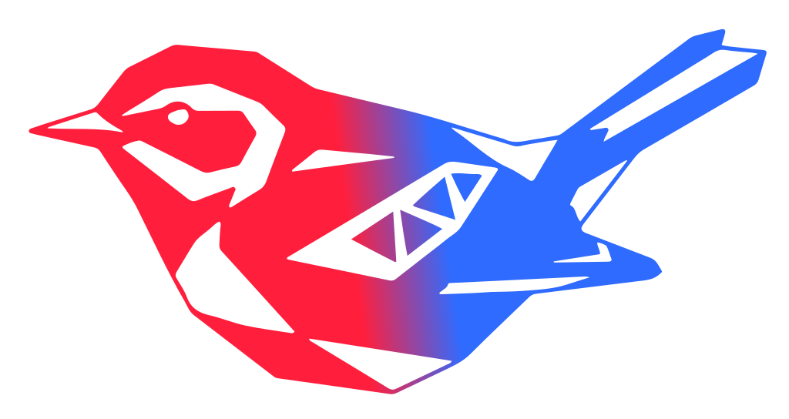
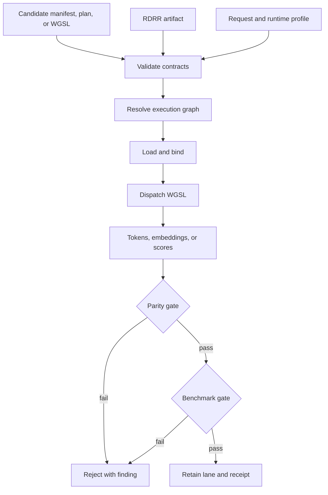

<p align="center">
  
</p>

# doppler-gpu

[](https://github.com/clocksmith/doppler/actions/workflows/check-green.yml)
[](https://www.npmjs.com/package/doppler-gpu)
[](https://github.com/clocksmith/doppler/blob/main/LICENSE)

Doppler is a JavaScript and WGSL WebGPU runtime for local model inference. It
loads supported RDRR artifacts, runs generation, embedding, and reranking in a
browser, Node, or Bun process, and checks candidate manifests, execution plans,
and kernels against correctness and benchmark gates.

## Mission, goal, and value

Doppler’s mission is to make model execution inspectable at the artifact,
kernel, and receipt boundary.

The current goal is to make local inference lanes easier to compare and improve.
An engineer can change a manifest, execution plan, or WGSL kernel; parity checks
compare the output with a reference; benchmark checks compare the same workload
with the retained lane; the receipts record why the candidate was retained or
rejected.

Doppler serves:

- Application builders who need local generation, embeddings, or reranking.
- Runtime engineers who work on model loading, kernels, scheduling, and GPU
  execution.
- Adapter and training engineers working with SafeTensors LoRA artifacts.
- Evidence reviewers who need the model, workload, parity result, and timing
  receipt behind a comparison.

## How to use Doppler

Run the CLI without installing a global package:

```bash
npx doppler-gpu "Summarize WebGPU in one sentence"
npx doppler-gpu --model qwen3-0.8b --prompt "Write a haiku about GPUs"
npx doppler-gpu --list-models
```

The live browser demo is at [d4da.com/doppler](https://d4da.com/doppler).
The first documentation path is [getting started](https://github.com/clocksmith/doppler/blob/main/docs/getting-started.md),
followed by the [Root API](https://github.com/clocksmith/doppler/blob/main/docs/api/root.md).

### Root API

```js
import { dr } from 'doppler-gpu';

const session = await dr.open('qwen3-0.8b');
const result = await session.generate('Describe WebGPU briefly');
console.log(result.outputText, result.fingerprint);
await session.close();
```

For streaming and evidence-bound output:

```js
const model = await dr.load('qwen3-0.8b');
for await (const token of model.generate('Describe WebGPU briefly')) {
  process.stdout.write(token);
}

const evidence = await model.generateWithEvidence('Explain WebGPU in one sentence', {
  maxTokens: 64,
  temperature: 0,
});
console.log(evidence.outputText, evidence.transcriptHash);
await model.unload();
```

### OpenAI-compatible server

```bash
npx doppler-serve --model qwen3-0.8b --port 8080
```

The server accepts requests at `http://localhost:8080/v1`. Registry IDs resolve
to hosted RDRR artifacts from `clocksmith/rdrr` by default.

### LoRA loading and training

```bash
npx doppler-gpu lora --config ./workload.json --surface node
```

Doppler supports SafeTensors LoRA loading and hot swap at runtime. SFT/LoRA
training is available through the experimental Node, Bun, and browser training
surface. Active adapters are listed in
[`models/adapters/catalog.json`](models/adapters/catalog.json). See the
[LoRA format](docs/lora-format.md), [training handbook](docs/training-handbook.md),
and [Training API](docs/api/training.md).

## Evidence and supported model types

Doppler classifies artifacts by their input and output shape. The counts below
are catalog and verification counts, not a promise that every declared input
works on every runtime surface.

| Type | Verified / cataloged | Input and output |
| --- | --- | --- |
| Text generators | 12 / 14 | `text -> text` |
| Multimodal generators | 3 / 3 | `audio + image + text -> text` |
| Diffusion language models | 0 / 1 | `text -> text` |
| Translation specialists | 2 / 2 | `text -> text` |
| Language embedders | 2 / 2 | `text -> embedding` |
| Rerankers | 2 / 2 | `text-pair -> relevance-score` |
| Protein encoders | 3 / 3 | `sequence -> embedding + token outputs` |
| Nucleotide encoders | 1 / 1 | `dna-seq -> embedding` |

The [model-support matrix](https://github.com/clocksmith/doppler/blob/main/docs/model-support-matrix.md)
lists each artifact, lane, and lifecycle status.

Doppler has accepted browser WebGPU comparisons with higher steady-state
throughput than Transformers.js where the declared workload correctness and
throughput gates pass. Loading is a separate measurement; the referenced
Vulkan embedding and reranker artifacts load faster in Transformers.js. The
[scoreboard](https://github.com/clocksmith/doppler/blob/main/docs/model-competition-scoreboard.md)
links the receipts and the [benchmark methodology](https://github.com/clocksmith/doppler/blob/main/docs/benchmark-methodology.md)
defines the gates.


## Execution and candidate flow


```mermaid
flowchart TB
  C[Candidate manifest, plan, or WGSL] --> V[Validate contracts]
  A[RDRR artifact] --> V
  R[Request and runtime profile] --> V
  V --> X[Resolve execution graph]
  X --> L[Load and bind]
  L --> D[Dispatch WGSL]
  D --> O[Tokens, embeddings, or scores]
  O --> P{Parity gate}
  P -- fail --> N[Reject with finding]
  P -- pass --> B{Benchmark gate}
  B -- fail --> N
  B -- pass --> K[Retain lane and receipt]
```

Candidates enter through manifests, execution plans, or WGSL kernels. The
runtime validates the artifact and request, resolves the execution graph, loads
the model and buffers, dispatches the selected kernels, and reads back the
result. A failed parity or benchmark gate rejects the candidate. A passed
candidate becomes a versioned lane with a receipt.

## Long-term vision

Doppler is intended to support a growing set of local model families and
runtime variants without hiding the model contract or execution path. Registered
variant calibration, paired performance gates, and WGSL experiments remain
human-reviewed. Ouroboros and Reploid sit above Doppler as orchestration or
product layers; Doppler owns the artifact and execution boundary.

New model families require RDRR conversion and may require tokenizer, graph, or
kernel support. Native packed-Q4K LoRA support is available for the declared
Qwen target; other packed-Q4K training targets use external backends.

## Limits and current status

WebGPU is required. Use a current Chromium browser; Node installs the WebGPU
provider as an optional dependency. A runtime pass does not verify every input
modality, and a receipt records what ran without establishing output quality.
Throughput comparisons are valid only when the workload, timing scope, and
correctness path are comparable. Unsupported paths fail closed.

## Repository map

- [Component charters](https://github.com/clocksmith/doppler/blob/main/CATSCAN.md) — recursive repository and subsystem intent
- [Component index](https://github.com/clocksmith/doppler/blob/main/docs/component-index.md) — generated authority and parent map
- [`src/`](src/) — runtime, model loading, inference, and execution contracts
- [`demo/`](demo/) — browser demo and its public API boundary
- [`models/adapters/`](models/adapters/) — adapter catalog and active LoRA metadata
- [`benchmarks/`](benchmarks/) — vendor comparisons and retained results
- [`docs/`](docs/) — APIs, architecture, formats, methodology, and release matrices
- [`tests/`](tests/) — runtime, contract, browser, and benchmark tests
- [`tools/`](tools/) — conversion, qualification, and operator tools

## Read next

- [Documentation index](https://github.com/clocksmith/doppler/blob/main/docs/INDEX.md)
- [Architecture](https://github.com/clocksmith/doppler/blob/main/docs/architecture.md)
- [RDRR format](https://github.com/clocksmith/doppler/blob/main/docs/rdrr-format.md)
- [Local GPU challenger framework](https://github.com/clocksmith/doppler/blob/main/docs/local-gpu-challenger-framework.md)
- [Program Bundles](https://github.com/clocksmith/doppler/blob/main/docs/integration/program-bundle.md)

## License

[MIT License](LICENSE). See [NOTICE](NOTICE) for attribution.
