# DOPPLER System Flow: Model to Execution

This document visualizes DOPPLER's architecture as a series of bipartite graphs showing how models flow through conversions, configurations, and kernel selections to final execution.

**See also:**
- [ARCHITECTURE.md](ARCHITECTURE.md) - Detailed component documentation
- [EXECUTION_PIPELINE.md](EXECUTION_PIPELINE.md) - Line-by-line kernel execution trace

---

## Overview: 5-Stage Bipartite Graph

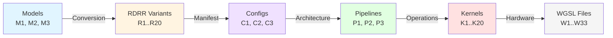

**Key Insight:** DOPPLER is configuration-driven. Model architecture determines pipeline structure; hardware capabilities determine kernel variants.

---

## Graph 1: Model → RDRR Conversion

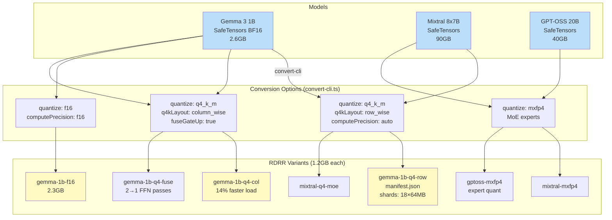

**Dimensions:** 1 source model → ~10-20 RDRR variants
- Quantization: {q4_k_m, q8_0, f16, bf16, f32, mxfp4}
- Q4K layout: {row_wise, column_wise, flat}
- Compute precision: {auto, f16, f32}
- FFN fusion: {true, false}

---

## Graph 2: RDRR → Manifest Config

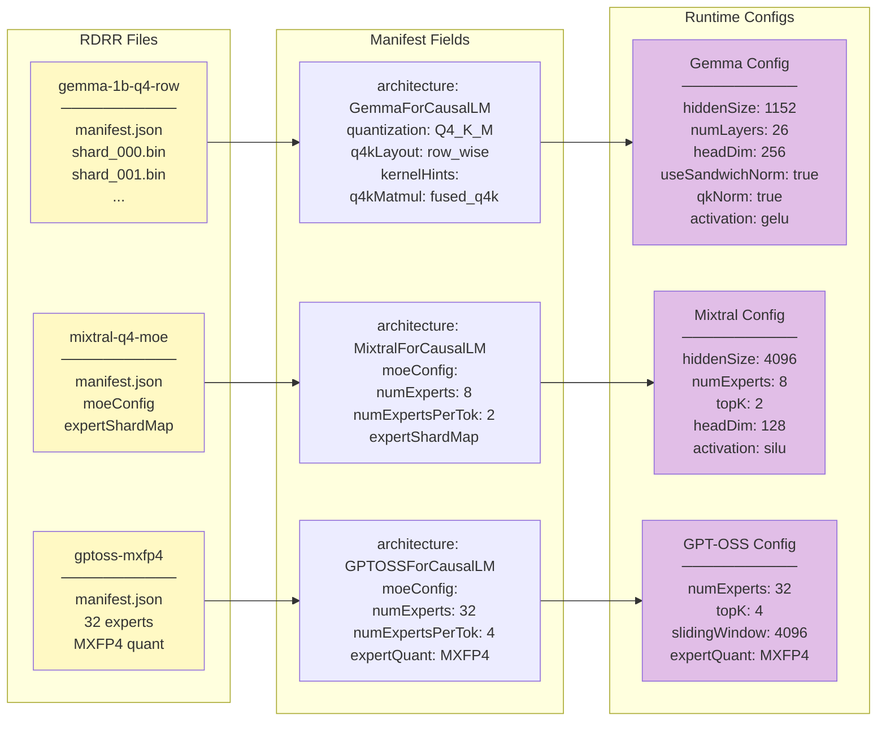

**Key Branching:**
- Dense models → single pipeline config
- MoE models → pipeline + expert routing config
- Sliding window → KV cache policy config

---

## Graph 3: Config → Pipeline Architecture

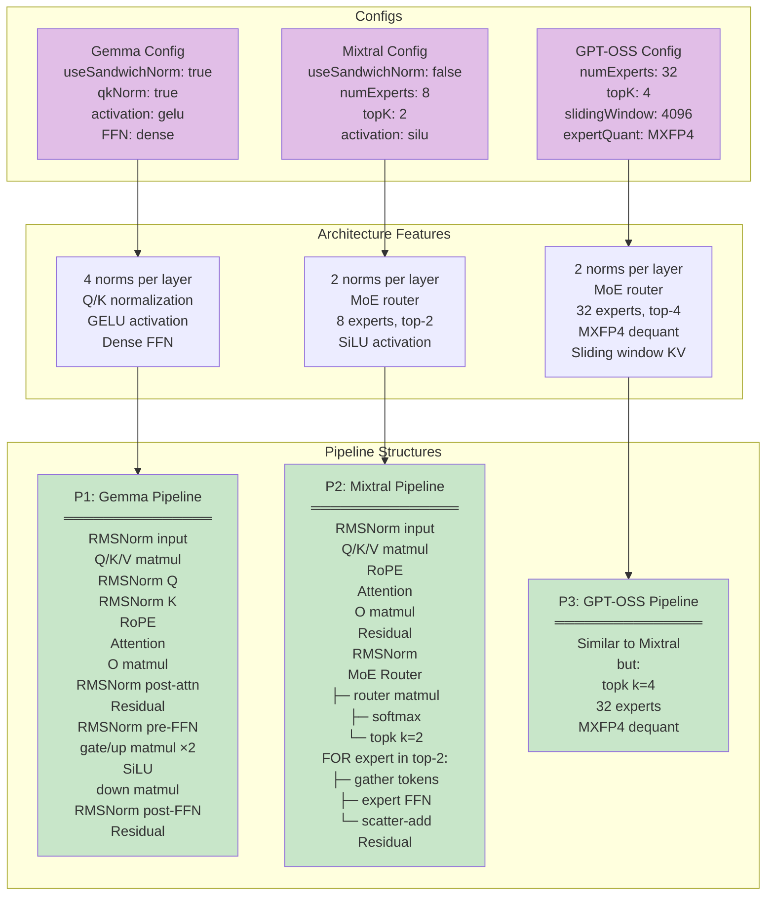

**Pipeline Dimensions:**
- Normalization: {sandwich (4 norms), standard (2 norms)}
- FFN type: {dense, moe}
- Activation: {gelu, silu, swiglu}
- KV cache: {full, sliding_window}

---

## Graph 4: Pipeline → Kernel Sequence (Per Token)

### Gemma 3 Pipeline Kernel Sequence

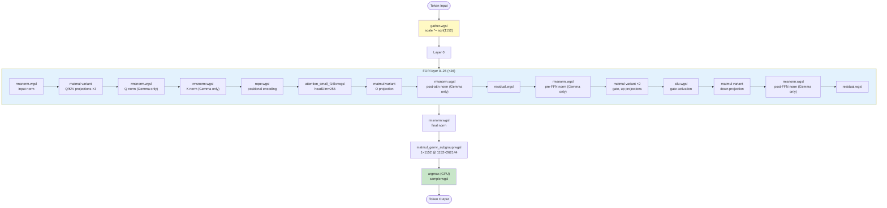

**Kernel count:** ~156 kernel dispatches per token
- 8 operations × 26 layers = 208 calls (many are rmsnorm due to sandwich)
- Gemma uses 4× more rmsnorm than standard architectures

### Mixtral Pipeline Kernel Sequence

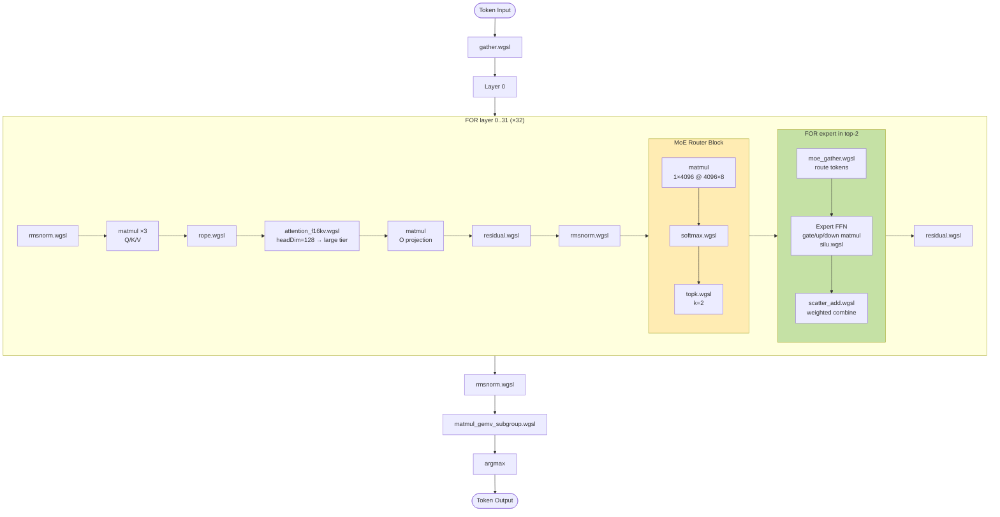

**Additional kernels vs Gemma:**
- `softmax.wgsl` - router logits
- `topk.wgsl` - expert selection
- `moe_gather.wgsl` - token routing
- `scatter_add.wgsl` - expert combination

**Removed kernels vs Gemma:**
- 2× fewer `rmsnorm.wgsl` (no sandwich norms)
- No Q/K normalization

---

## Graph 5: Kernel → WGSL Variant Selection

### MatMul Kernel Selection

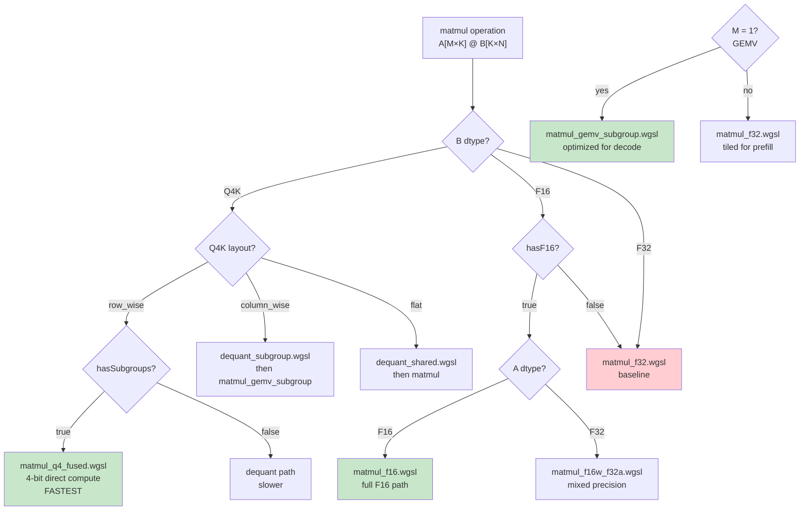

**Hardware dimensions:**
- `hasF16`: {true, false} → shader-f16 extension
- `hasSubgroups`: {true, false} → subgroup operations
- `M=1`: decode (GEMV) vs prefill (general matmul)

### Attention Kernel Selection

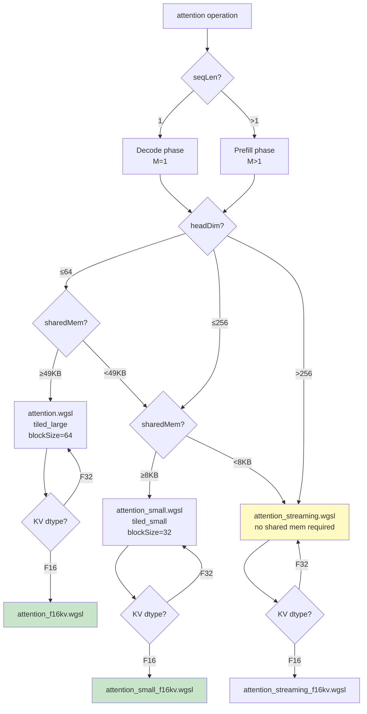

**Examples:**
- Gemma 1B (headDim=256, M3 32KB shared) → `attention_small_f16kv.wgsl`
- Mixtral (headDim=128, RTX 4090 48KB shared) → `attention_f16kv.wgsl`
- Low-memory device (<8KB shared) → `attention_streaming.wgsl`

---

## Complete Flow Example: Gemma 3 1B on Apple M3

```mermaid
graph TD
    subgraph Stage1["1. Source Model"]
        Source["google/gemma-3-1b-it<br/>SafeTensors BF16<br/>2.6GB"]
    end

    subgraph Stage2["2. Conversion"]
        Conv["convert-cli.ts<br/>--quantize q4_k_m<br/>--q4k-layout column_wise<br/>--compute-precision auto"]
    end

    subgraph Stage3["3. RDRR Output"]
        RDRR["gemma-1b-q4-col<br/>1.2GB<br/>18 shards × 64MB<br/>manifest.json"]
    end

    subgraph Stage4["4. Manifest Config"]
        Manifest["architecture: GemmaForCausalLM<br/>quantization: Q4_K_M<br/>q4kLayout: column_wise<br/>config:<br/>&nbsp;&nbsp;hiddenSize: 1152<br/>&nbsp;&nbsp;numLayers: 26<br/>&nbsp;&nbsp;headDim: 256<br/>kernelHints:<br/>&nbsp;&nbsp;q4kMatmul: dequant_f16<br/>&nbsp;&nbsp;computePrecision: f16"]
    end

    subgraph Stage5["5. Hardware Detection (M3)"]
        HW["hasF16: true<br/>hasSubgroups: true<br/>sharedMem: 32KB<br/>isUnifiedMemory: true"]
    end

    subgraph Stage6["6. Pipeline Selection"]
        Pipeline["Gemma Pipeline<br/>useSandwichNorm: true<br/>qkNorm: true<br/>activation: gelu<br/>4 norms per layer"]
    end

    subgraph Stage7["7. Kernel Execution (per token)"]
        Kernels["Embed: gather_f16.wgsl<br/>───────────────────<br/>FOR layer 0..25:<br/>&nbsp;&nbsp;Input norm: rmsnorm.wgsl<br/>&nbsp;&nbsp;Q/K/V: matmul_gemv_subgroup.wgsl ×3<br/>&nbsp;&nbsp;Q/K norm: rmsnorm.wgsl ×2<br/>&nbsp;&nbsp;RoPE: rope.wgsl<br/>&nbsp;&nbsp;Attention: attention_small_f16kv.wgsl<br/>&nbsp;&nbsp;O proj: matmul_gemv_subgroup.wgsl<br/>&nbsp;&nbsp;Post-attn norm: rmsnorm.wgsl<br/>&nbsp;&nbsp;Residual: residual.wgsl<br/>&nbsp;&nbsp;Pre-FFN norm: rmsnorm.wgsl<br/>&nbsp;&nbsp;gate/up: matmul_gemv_subgroup.wgsl ×2<br/>&nbsp;&nbsp;SiLU: silu.wgsl<br/>&nbsp;&nbsp;down: matmul_gemv_subgroup.wgsl<br/>&nbsp;&nbsp;Post-FFN norm: rmsnorm.wgsl<br/>&nbsp;&nbsp;Residual: residual.wgsl<br/>───────────────────<br/>Final: rmsnorm.wgsl<br/>LM head: matmul_gemv_subgroup.wgsl<br/>Sample: argmax (GPU)"]
    end

    subgraph Stage8["8. Performance"]
        Perf["~156 kernel dispatches/token<br/>~140ms/token<br/>~7 tok/s"]
    end

    Source --> Conv --> RDRR --> Manifest
    Manifest --> HW
    Manifest --> Pipeline
    HW --> Pipeline
    Pipeline --> Kernels --> Perf

    style Source fill:#bbdefb
    style RDRR fill:#fff9c4
    style Manifest fill:#e1bee7
    style HW fill:#ffecb3
    style Pipeline fill:#c8e6c9
    style Kernels fill:#f5f5f5
    style Perf fill:#c8e6c9
```

---

## Architecture Comparison: Gemma 3 vs GPT-OSS

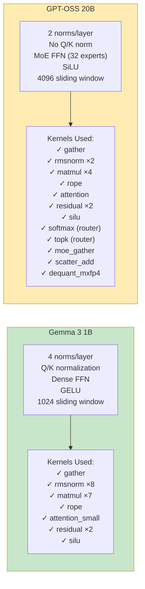

**Key Differences:**
- Gemma: More normalization layers (+6 rmsnorm/layer)
- GPT-OSS: MoE routing kernels (+5 unique kernels)
- Same core: matmul, attention, rope, residual (reused!)

---

## Kernel Reuse Matrix

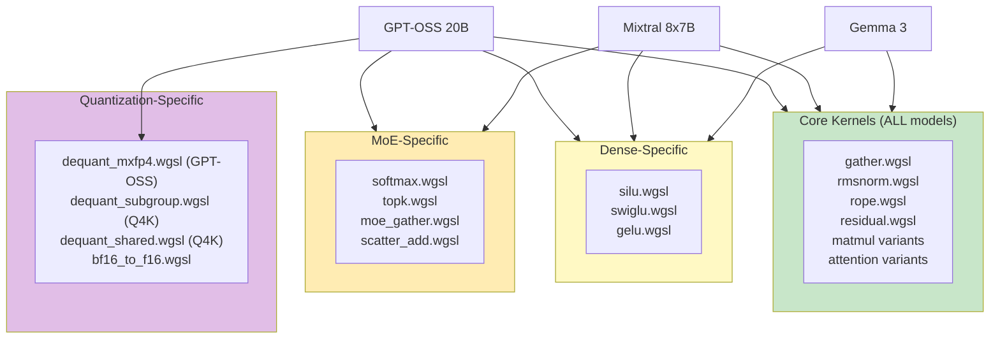

**Total:** 33 WGSL files
**Used per model:** ~10-15 (subset based on architecture)

---

## Key Insights

### 1. Configuration-Driven System

DOPPLER is **not** hard-coded per model. The system adapts through configuration:

```
Model Architecture → Pipeline Structure
     ↓
Pipeline Structure → Kernel Sequence
     ↓
Hardware + dtypes → WGSL Variant
```

### 2. Variant Explosion

```
1 source model
  → ~10-20 RDRR variants (quantization × layout × options)
    → 1 config per RDRR
      → 1 pipeline type
        → N kernel dispatches (architecture-dependent)
          → M WGSL files (hardware-dependent)
```

### 3. Kernel Selection Factors

| Factor | Examples | Impact |
|--------|----------|--------|
| **Architecture** | useSandwichNorm, qkNorm, MoE | Determines WHICH operations |
| **Quantization** | Q4K layout, MXFP4 | Determines dequant path |
| **Hardware** | hasF16, hasSubgroups, sharedMem | Determines WGSL variant |
| **Tensor shape** | M=1 (GEMV), headDim (attention tier) | Determines kernel specialization |

### 4. Same Operations, Different Counts

Gemma 3 and Mixtral both use `matmul`, but:
- **Gemma:** 7 matmul calls per layer (Q/K/V/O + gate/up/down)
- **Mixtral:** 4 matmul calls + MoE router matmul + expert matmuls

Same kernel, different usage patterns based on architecture.

---

## Performance Analysis

### Kernel Dispatch Count (Decode, 1 token)

| Model | Layers | Kernels/Layer | Total/Token | Notes |
|-------|--------|---------------|-------------|-------|
| Gemma 3 1B | 26 | ~6 ops | ~156 | 4 norms = heavy |
| Mixtral 8x7B | 32 | ~5 ops + router | ~180 | +MoE overhead |
| Standard LLaMA | 32 | ~4 ops | ~128 | 2 norms only |

### Latency Breakdown (Gemma 3 1B, M3)

```
Total: 140ms/token
├─ MatMul: ~100ms (71%) - 7×26 = 182 matmuls
├─ Attention: ~25ms (18%) - 26 attention ops
├─ RMSNorm: ~10ms (7%) - 8×26 = 208 norms
├─ Other: ~5ms (4%) - rope, residual, silu
```

**Bottleneck:** MatMul (column-wise Q4K dequant + F16 compute)

---

*Last updated: December 2025*
