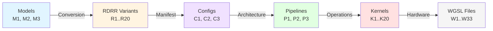
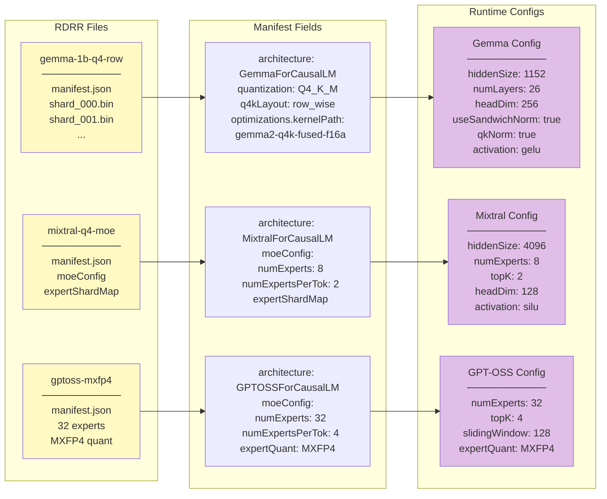
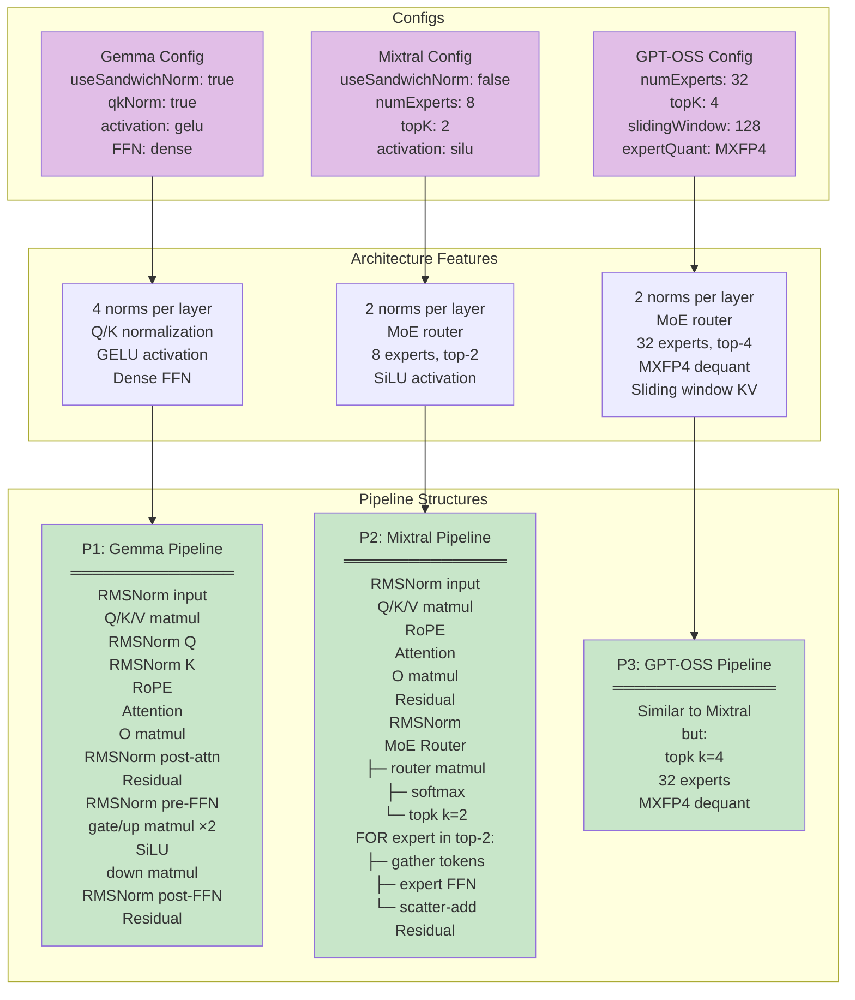
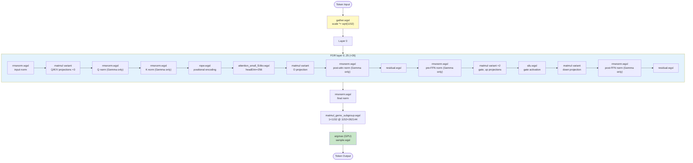
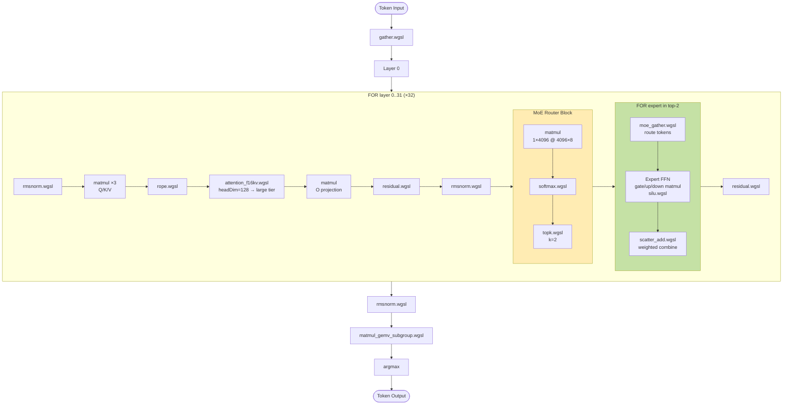
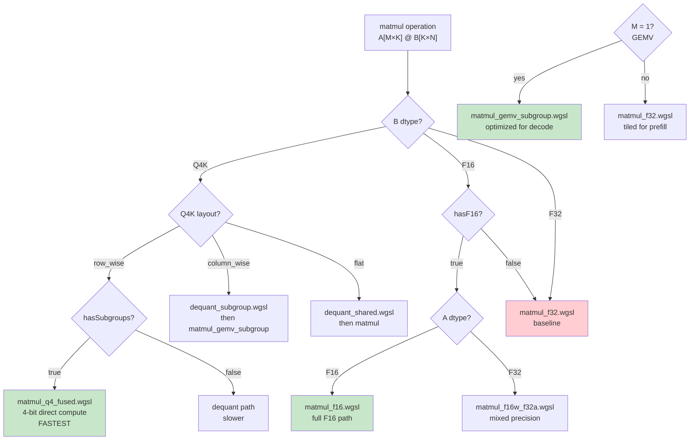
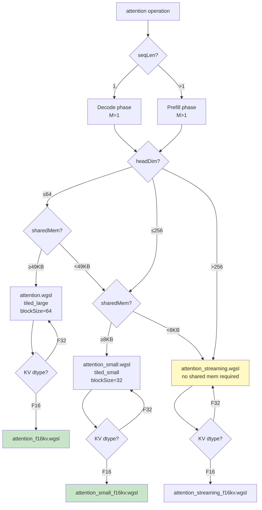
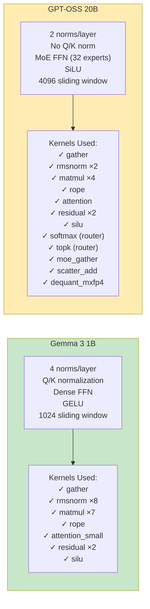
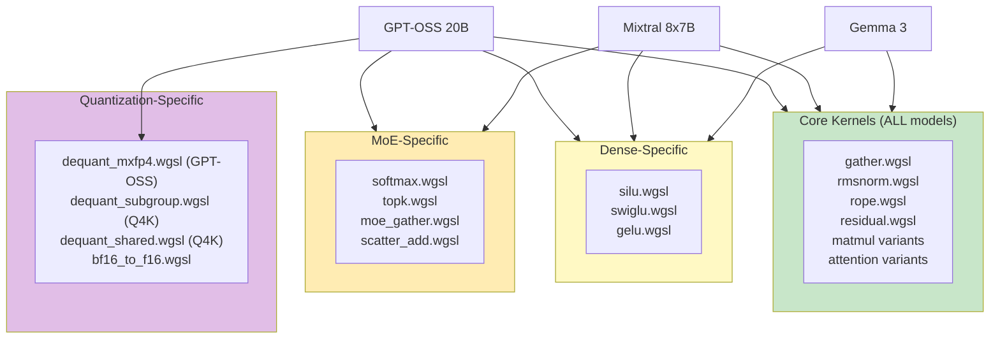

# Pipeline Execution & Fusion
## Execution Pipeline

This document details the lifecycle of a token in Gemma 3 1B, moving from raw integer IDs to probability distributions. It covers the specific WGSL kernels used, tensor shapes at each step, memory hierarchy, and kernel fusion strategies for running LLMs efficiently in a browser environment.

**Related:** `ARCHITECTURE.md` for module structure.

---

## Model Parameters (Gemma 3 1B)

| Parameter | Value | Notes |
|-----------|-------|-------|
| `numLayers` | 26 | Transformer blocks |
| `hiddenSize` | 1152 | Embedding dimension |
| `numHeads` | 4 | Query heads |
| `numKVHeads` | 1 | Key/Value heads (GQA) |
| `headDim` | 256 | `query_pre_attn_scalar` |
| `intermediateSize` | 6912 | FFN hidden (6x) |
| `vocabSize` | 262144 | Token vocabulary |
| `maxSeqLen` | 32768 | Context window |
| `slidingWindow` | 512 | Local attention window |
| `ropeTheta` | 1000000 | RoPE base frequency |
| `rmsNormEps` | 1e-6 | Normalization epsilon |
| `hiddenActivation` | gelu | GELU activation (not SiLU) |

---

## Part I: The Execution Pipeline

Gemma 3 1B utilizes a **mixed-precision architecture**. To maximize memory bandwidth (the primary bottleneck in LLM inference), weights are stored and loaded in `f16`. However, to prevent numerical underflow, all accumulations (dot products, reductions) occur in `f32`.

---

### Phase 1: Embedding

**Kernel:** `gather.wgsl`

The pipeline begins by converting discrete token IDs into dense vectors.

**What happens:**

```
Input:  token_ids[seq_len]           e.g., [1, 15043, 2845, ...] for 512 tokens
        embedding_table[262144, 1152]

For each token position i in [0, seq_len):
    token_id = token_ids[i]
    For each hidden dimension d in [0, 1151]:
        output[i, d] = embedding_table[token_id * 1152 + d]

Output: embeddings[seq_len, 1152]
```

The embedding table is `[262144, 1152]` - 262K vocabulary entries, each a 1152-dimensional vector. The kernel performs a parallel lookup, with each thread handling one output element.

**Gemma-specific scaling:** Unlike Llama, Gemma stabilizes signal propagation at the start by scaling embeddings:

```
scaled_output[i, d] = embeddings[i, d] * sqrt(1152)
```

The constant is approximately 33.94. This prevents the variance of embedding vectors from shrinking as they pass through deep layers.

**Dispatch:** `ceil((seq_len * 1152) / 256)` workgroups of 256 threads.

---

### Phase 2: Transformer Layers (x26)

The core computation happens in 26 identical stacked layers. Each layer transforms the hidden state `[seq_len, 1152]` while preserving its shape.

---

#### 2.1 Input RMSNorm

**Kernel:** `rmsnorm.wgsl`

RMSNorm normalizes each token's hidden state independently. Unlike LayerNorm, it doesn't subtract the mean - just divides by root-mean-square. This is computationally cheaper.

**What happens:**

```
Input:  hidden[seq_len, 1152]
        norm_weight[1152]

For each token position i in [0, seq_len):

    # Compute RMS of this token's hidden state
    sum_of_squares = 0
    For d in [0, 1151]:
        sum_of_squares += hidden[i, d] * hidden[i, d]

    rms = sqrt(sum_of_squares / 1152 + 1e-6)  # epsilon for stability

    # Normalize and apply learned weight
    For d in [0, 1151]:
        output[i, d] = (hidden[i, d] / rms) * norm_weight[d]

Output: normed[seq_len, 1152]
```

**Workgroup strategy:** 256 threads collaborate via shared memory to compute `sum_of_squares` using parallel reduction. Each workgroup handles one token entirely.

**Dispatch:** `seq_len` workgroups (one per token).

---

#### 2.2 Q/K/V Projections

**Kernel:** `matmul_f16w_f32a.wgsl` (three separate dispatches)

Three matrix multiplications project the normalized hidden states into query, key, and value spaces. Gemma 3 uses **Grouped Query Attention (GQA)** where 4 query heads share 1 KV head.

**What happens:**

```
Input:  normed[seq_len, 1152]
        q_weight[1024, 1152]  (F16)  # 4 heads × 256 headDim
        k_weight[256, 1152]   (F16)  # 1 KV head × 256 headDim
        v_weight[256, 1152]   (F16)  # 1 KV head × 256 headDim

# Q Projection: [seq_len, 1152] @ [1024, 1152]^T -> [seq_len, 1024]
For each output position (row i, col j):
    accumulator = 0.0  (F32 for precision)
    For k in [0, 1151]:
        w = f16_to_f32(q_weight[j, k])
        a = normed[i, k]
        accumulator += w * a
    Q[i, j] = accumulator

# K Projection: [seq_len, 1152] @ [256, 1152]^T -> [seq_len, 256]
# V Projection: [seq_len, 1152] @ [256, 1152]^T -> [seq_len, 256]
# (Same algorithm, smaller output dimension due to GQA)

Output: Q[seq_len, 1024], K[seq_len, 256], V[seq_len, 256]
```

**Why GQA?** The 4:1 ratio (4 Q heads, 1 KV head) reduces KV cache size by 4x, allowing longer context windows on consumer hardware.

**Tiling strategy:** The kernel uses 8x128 output tiles. Workgroups cooperatively load F16 weight tiles into shared memory to maximize data reuse before computing F32 dot products.

**Dispatch:** `ceil(N/128) x ceil(M/8)` workgroups for each projection.

---

#### 2.2.1 Q/K Normalization (Gemma 3 Specific)

**Kernel:** `rmsnorm.wgsl` (two dispatches)

Gemma 3 applies RMSNorm to Q and K tensors **before** RoPE. This stabilizes attention scores and improves training convergence.

**What happens:**

```
Input:  Q[seq_len, 1024]
        K[seq_len, 256]
        q_norm_weight[256]  # Per-head normalization
        k_norm_weight[256]

# For each query head h in [0, 3]:
For each token i:
    head_start = h * 256
    rms_q = sqrt(mean(Q[i, head_start:head_start+256]^2) + eps)
    Q[i, head_start:head_start+256] /= rms_q
    Q[i, head_start:head_start+256] *= q_norm_weight[:]

# For K (single KV head):
For each token i:
    rms_k = sqrt(mean(K[i, :]^2) + eps)
    K[i, :] /= rms_k
    K[i, :] *= k_norm_weight[:]

Output: Q[seq_len, 1024] (normalized), K[seq_len, 256] (normalized)
```

**Why Q/K Norm?** Without normalization, Q·K dot products can explode as sequence length grows. This is especially important for Gemma 3's large context window (32K tokens).

---

#### 2.3 Rotary Position Embeddings (RoPE)

**Kernel:** `rope.wgsl` (two dispatches: Q and K)

Since Transformers process all tokens simultaneously, they have no inherent concept of order. RoPE encodes position by rotating pairs of dimensions in complex space.

**What happens:**

```
Input:  Q[seq_len, 1024], K[seq_len, 256]
        rope_cos[max_seq_len, 128]  (precomputed)
        rope_sin[max_seq_len, 128]  (precomputed)

For each token position pos in [0, seq_len):
    For each head h in [0, num_heads):  # Q: 4 heads, K: 1 head
        For each dimension pair d in [0, 127]:  # 256 dims = 128 pairs

            # Lookup precomputed frequencies for this position
            cos_theta = rope_cos[pos, d]
            sin_theta = rope_sin[pos, d]

            # Get the two values to rotate
            idx = h * 256 + d * 2
            x0 = Q[pos, idx]
            x1 = Q[pos, idx + 1]

            # Apply 2D rotation matrix (in-place)
            Q[pos, idx]     = x0 * cos_theta - x1 * sin_theta
            Q[pos, idx + 1] = x0 * sin_theta + x1 * cos_theta

Output: Q[seq_len, 1024] (rotated), K[seq_len, 256] (rotated)
```

**The math:** Pairs of dimensions `(x, y)` are rotated by angle theta. Low dimensions rotate slowly (low frequency), high dimensions rotate quickly (high frequency). This frequency differential allows attention to measure relative distances between tokens through dot product patterns.

**Precomputation:** Frequencies are computed once at initialization:
```
For position m, dimension pair d:
    theta = rope_theta^(-2d/head_dim)  # rope_theta = 1,000,000 for Gemma 3
    rope_cos[m, d] = cos(m * theta)
    rope_sin[m, d] = sin(m * theta)
```

**Gemma 3 RoPE:** Uses a very high base frequency (1,000,000 vs typical 10,000) which enables better extrapolation to longer sequences.

---

#### 2.4 KV Cache Update

**Operation:** GPU buffer copy (+ optional F16 cast kernel)

Before attention, the rotated K and V vectors are appended to the KV cache for this layer.

```
# Prefill: Write all positions at once
kv_cache.keys[layer_idx, 0:seq_len, :] = K_rotated[0:seq_len, :]  # [seq_len, 256]
kv_cache.vals[layer_idx, 0:seq_len, :] = V_rotated[0:seq_len, :]  # [seq_len, 256]

# Decode: Append one position
kv_cache.keys[layer_idx, current_pos, :] = K_rotated[0, :]  # [256]
kv_cache.vals[layer_idx, current_pos, :] = V_rotated[0, :]  # [256]
```

**F16 casting:** If using F16 KV cache to save VRAM, `cast_f32_to_f16.wgsl` runs first. This halves KV cache memory, critical for Gemma 3's 32K context. KV cache dtype defaults to `f16` when `shader-f16` is available; attention softcapping can still run in F16 by default, and you can force `f32` via `runtime.inference.kvcache.forceF32Softcap` if precision issues show up (or when F16 is unsupported).

**Sliding window:** Gemma 3 uses a sliding window pattern (`slidingWindow: 512`) for most layers. Only every 6th layer attends to the full context.

---

#### 2.5 Attention

**Kernel:** `attention.wgsl` (tiled) or `attention_streaming.wgsl` (for large headDim)

This is the most complex kernel in the pipeline. It computes scaled dot-product attention: `Softmax(QK^T / sqrt(d)) @ V` with causal masking.

**Gemma 3 headDim (256):** With headDim=256, Gemma 3 can use efficient **tiled attention** (unlike older Gemma 1B which needed streaming due to headDim=384).

**What happens:**

```
Input:  Q[seq_len, 1024]          # 4 heads x 256 dims
        K_cache[kv_len, 256]      # 1 KV head x 256 dims
        V_cache[kv_len, 256]
        scale = 1/sqrt(256) = 0.0625

For each query position q_pos in [0, seq_len):
    For each query head h in [0, 3]:

        # Initialize online softmax tracking
        max_score = -infinity
        sum_exp = 0.0
        accumulator[256] = zeros

        # Determine attention window (sliding or full)
        if layer_idx % 6 == 0:
            window_start = 0  # Full attention every 6th layer
        else:
            window_start = max(0, q_pos - 512)  # Sliding window

        # Stream through key positions in window (causal: only up to q_pos)
        For kv_pos in [window_start, q_pos]:  # Causal mask + sliding window

            # Compute attention score: Q dot K / sqrt(d)
            score = 0.0
            For d in [0, 255]:
                score += Q[q_pos, h*256 + d] * K_cache[kv_pos, d]
            score = score * scale

            # Online softmax update (Flash Attention style)
            new_max = max(max_score, score)

            # Rescale previous accumulator for new max
            scale_old = exp(max_score - new_max)
            accumulator = accumulator * scale_old
            sum_exp = sum_exp * scale_old

            # Add this position's contribution
            weight = exp(score - new_max)
            sum_exp += weight
            For d in [0, 255]:
                accumulator[d] += weight * V_cache[kv_pos, d]

            max_score = new_max

        # Normalize by sum of exponentials
        For d in [0, 255]:
            output[q_pos, h*256 + d] = accumulator[d] / sum_exp

Output: attn_output[seq_len, 1024]
```

**Sliding window attention:** Most layers only attend to the last 512 tokens. Every 6th layer (0, 6, 12, 18, 24) attends to the full context. This reduces memory and compute while preserving long-range information.

**GQA handling:** All 4 query heads attend to the same single KV head. The kernel broadcasts K/V across query heads.

**Dispatch:** `seq_len * num_heads` workgroups for prefill (e.g., 512 * 4 = 2048).

---

#### 2.6 Output Projection

**Kernel:** `matmul_f16w_f32a.wgsl`

Projects attention output back to hidden dimension.

**What happens:**

```
Input:  attn_output[seq_len, 1024]
        o_proj_weight[1152, 1024]  (F16)

# [seq_len, 1024] @ [1152, 1024]^T -> [seq_len, 1152]
For each output position (i, j):
    output[i, j] = sum over k: attn_output[i, k] * o_proj_weight[j, k]

Output: proj_output[seq_len, 1152]
```

Same tiled matmul as Q/K/V projections.

---

#### 2.7 Residual Connection (Attention)

**Kernel:** `residual.wgsl`

The skip connection that makes deep networks trainable.

**What happens:**

```
Input:  attn_output[seq_len, 1152]
        layer_input[seq_len, 1152]  (before input norm)

For each element (i, j):
    output[i, j] = attn_output[i, j] + layer_input[i, j]

Output: post_attn[seq_len, 1152]
```

This creates the residual stream - information flows through additions rather than transformations, preserving gradient flow.

---

#### 2.8 Post-Attention RMSNorm (Sandwich Norm)

**Kernel:** `rmsnorm.wgsl`

**Gemma 3 specific:** Uses "sandwich norm" architecture with a **separate** post-attention norm (not shared with input norm). This improves training stability.

```
Input:  post_attn[seq_len, 1152]
        post_attn_norm_weight[1152]  # Separate learned weights

For each token i:
    rms = sqrt(mean(post_attn[i, :]^2) + eps)
    output[i, :] = (post_attn[i, :] / rms) * post_attn_norm_weight[:]

Output: normed_post_attn[seq_len, 1152]
```

---

#### 2.9 FFN Gate+Up Projection (Fused)

**Kernel:** `matmul_f16w_f32a.wgsl`

**Gemma 3 uses fused gate_up weights** - a single matmul produces both gate and up projections concatenated together. This is more efficient than two separate matmuls.

```
Input:  ffn_input[seq_len, 1152]
        gate_up_weight[13824, 1152]  # 6912 * 2 = 13824

# [seq_len, 1152] @ [13824, 1152]^T -> [seq_len, 13824]
# Output contains [gate, up] concatenated: first 6912 dims are gate, last 6912 are up
gate_up_output[i, j] = sum over k: ffn_input[i, k] * gate_up_weight[j, k]

Output: gate_up[seq_len, 13824]
```

**Why fused?** One matmul instead of two reduces kernel launch overhead and memory traffic.

---

#### 2.10 GELU Activation + Row Split

**Kernel:** `silu.wgsl` → `runSiLURowSplit` (with GELU mode)

**Gemma 3 uses GELU activation** (not SiLU like LLaMA). The fused kernel splits the gate_up output, applies GELU to the gate portion, and multiplies with up.

**What happens:**

```
Input:  gate_up[seq_len, 13824]  # [gate, up] concatenated

For each token i:
    # Split the row in half
    gate = gate_up[i, 0:6912]
    up = gate_up[i, 6912:13824]

    For each element j in [0, 6911]:
        x = gate[j]

        # GELU approximation (tanh variant used by Gemma 3)
        gelu_x = 0.5 * x * (1 + tanh(sqrt(2/π) * (x + 0.044715 * x³)))

        # Multiply by up (gated linear unit)
        output[i, j] = gelu_x * up[j]

Output: activated[seq_len, 6912]
```

**Why GELU?** Gemma 3 uses `gelu_pytorch_tanh` activation which provides smoother gradients than SiLU, improving training stability.

---

#### 2.11 FFN Down Projection

**Kernel:** `matmul_f16w_f32a.wgsl`

Projects back from intermediate size to hidden size.

```
Input:  activated[seq_len, 6912]
        down_weight[1152, 6912]

# [seq_len, 6912] @ [1152, 6912]^T -> [seq_len, 1152]
output[i, j] = sum over k: activated[i, k] * down_weight[j, k]

Output: ffn_output[seq_len, 1152]
```

---

#### 2.12 Residual Connection (FFN)

**Kernel:** `residual.wgsl`

Add FFN output to residual stream.

```
For each element (i, j):
    output[i, j] = ffn_output[i, j] + normed_post_attn[i, j]

Output: layer_output[seq_len, 1152]
```

This output becomes the input to the next layer (or final norm if this is layer 25).

---

### Phase 3: Final Norm

**Kernel:** `rmsnorm.wgsl`

After all 26 layers complete:

```
Input:  hidden[seq_len, 1152]  (output of layer 25)
        final_norm_weight[1152]

For each token i:
    rms = sqrt(mean(hidden[i, :]^2) + eps)
    normed[i, :] = (hidden[i, :] / rms) * final_norm_weight[:]

Output: final_normed[seq_len, 1152]
```

---

### Phase 4: LM Head (Vocabulary Projection)

**Kernel:** `matmul_f16w_f32a.wgsl`

The largest single matmul - projects to vocabulary size.

```
Input:  final_normed[seq_len, 1152]
        lm_head_weight[262144, 1152]

# [seq_len, 1152] @ [262144, 1152]^T -> [seq_len, 262144]
For each position i, vocab index v:
    logits[i, v] = sum over k: final_normed[i, k] * lm_head_weight[v, k]

Output: logits[seq_len, 262144]
```

This is often the most bandwidth-intensive single operation due to the massive 262K vocabulary.

---

### Phase 5: Sampling

**CPU operation** (or optional `sample.wgsl` for GPU sampling)

```
# Extract last position's logits (for next token prediction)
last_logits = logits[seq_len - 1, :]  # [262144]

# Apply temperature scaling
last_logits = last_logits / temperature

# Apply top-k filtering
top_k_indices = argsort(last_logits, descending=True)[:k]
mask all other indices to -infinity

# Apply top-p (nucleus) filtering
sorted_probs = softmax(last_logits[top_k_indices])
cumulative = cumsum(sorted_probs)
cutoff = first index where cumulative > p
mask indices after cutoff

# Convert to probabilities
probs = softmax(last_logits)

# Sample from categorical distribution
next_token_id = multinomial_sample(probs)
```

---

## Decode Phase (Token-by-Token Generation)

After prefill, each new token uses the same kernels but optimized for single-token processing.

### Key Differences from Prefill

| Aspect | Prefill | Decode |
|--------|---------|--------|
| Input shape | `[seq_len, ...]` | `[1, ...]` |
| Matmul kernel | `matmul_f16w_f32a.wgsl` | `matmul_gemv.wgsl` |
| Attention | Process all positions | Read KV cache (sliding window), add one |
| RoPE position | 0 to seq_len-1 | current_position |
| Parallelism | High (many tokens) | Low (one token) |

### GEMV Optimization

**Kernel:** `matmul_gemv.wgsl` (or `matmul_gemv_subgroup.wgsl`)

For single-token decode, matrix-vector multiply (GEMV) is 5-10x faster than batched matmul:

```
# GEMV: [1, K] @ [K, N] -> [1, N]
# Instead of tiling, use full vector parallelism

For each output dimension j (in parallel):
    accumulator = 0.0
    For k in [0, K):
        accumulator += input[k] * weight[j, k]
    output[j] = accumulator
```

A single workgroup of 256 threads can handle the entire operation, with each thread computing one or more output elements.

### Decode Attention (with Sliding Window)

During decode, attention reads from the growing KV cache, but most layers only attend to the last 512 positions:

```
# Prefill filled positions [0, prefill_len)
# Decode step N reads from cache and appends one K/V

For decode step:
    kv_len = prefill_len + decode_step

    # Determine window (most layers use sliding window)
    if layer_idx % 6 == 0:
        window_start = 0  # Full attention
    else:
        window_start = max(0, kv_len - 512)  # Sliding window

    # Attention over window
    For kv_pos in [window_start, kv_len):
        score = Q[0] dot K_cache[kv_pos]
        # ... accumulate weighted V

    # Append new K/V at position kv_len
    K_cache[kv_len] = K_new
    V_cache[kv_len] = V_new
```

**Sliding window benefit:** Decode attention is O(1) for most layers (fixed 512 window) instead of O(N).

---

## Kernel Summary Tables

### Prefill Kernels Per Layer (seq_len=512, Gemma 3 1B)

| # | Operation | Kernel | Input Shape | Output Shape |
|---|-----------|--------|-------------|--------------|
| 1 | Input Norm | `rmsnorm.wgsl` | [512, 1152] | [512, 1152] |
| 2 | Q Projection | `matmul_f16w_f32a.wgsl` | [512, 1152] | [512, 1024] |
| 3 | K Projection | `matmul_f16w_f32a.wgsl` | [512, 1152] | [512, 256] |
| 4 | V Projection | `matmul_f16w_f32a.wgsl` | [512, 1152] | [512, 256] |
| 5 | Q Norm | `rmsnorm.wgsl` | [512, 1024] | [512, 1024] |
| 6 | K Norm | `rmsnorm.wgsl` | [512, 256] | [512, 256] |
| 7 | RoPE (Q) | `rope.wgsl` | [512, 1024] | [512, 1024] |
| 8 | RoPE (K) | `rope.wgsl` | [512, 256] | [512, 256] |
| 9 | KV F16 Cast | `cast_f32_to_f16.wgsl` | K, V | K_f16, V_f16 |
| 10 | Attention | `attention.wgsl` | Q, K, V | [512, 1024] |
| 11 | O Projection | `matmul_f16w_f32a.wgsl` | [512, 1024] | [512, 1152] |
| 12 | Residual | `residual.wgsl` | [512, 1152] x2 | [512, 1152] |
| 13 | Post-Attn Norm | `rmsnorm.wgsl` | [512, 1152] | [512, 1152] |
| 14 | Gate+Up Proj | `matmul_f16w_f32a.wgsl` | [512, 1152] | [512, 13824] |
| 15 | GELU + Split | `silu.wgsl` (GELU mode) | [512, 13824] | [512, 6912] |
| 16 | Down Projection | `matmul_f16w_f32a.wgsl` | [512, 6912] | [512, 1152] |
| 17 | Residual | `residual.wgsl` | [512, 1152] x2 | [512, 1152] |

**Total:** 17 kernels/layer × 26 layers = **442 dispatches** (+ embed + final norm + LM head)

### Decode Kernels Per Layer

| # | Operation | Kernel | Input Shape | Output Shape |
|---|-----------|--------|-------------|--------------|
| 1 | Input Norm | `rmsnorm.wgsl` | [1, 1152] | [1, 1152] |
| 2 | Q Projection | `matmul_gemv.wgsl` | [1, 1152] | [1, 1024] |
| 3 | K Projection | `matmul_gemv.wgsl` | [1, 1152] | [1, 256] |
| 4 | V Projection | `matmul_gemv.wgsl` | [1, 1152] | [1, 256] |
| 5 | Q Norm | `rmsnorm.wgsl` | [1, 1024] | [1, 1024] |
| 6 | K Norm | `rmsnorm.wgsl` | [1, 256] | [1, 256] |
| 7 | RoPE | `rope.wgsl` | Q, K | Q, K |
| 8 | KV F16 Cast | `cast_f32_to_f16.wgsl` | K, V | K_f16, V_f16 |
| 9 | Attention | `attention.wgsl` | Q + cache | [1, 1024] |
| 10 | O Projection | `matmul_gemv.wgsl` | [1, 1024] | [1, 1152] |
| 11 | Residual | `residual.wgsl` | [1, 1152] x2 | [1, 1152] |
| 12 | Post-Attn Norm | `rmsnorm.wgsl` | [1, 1152] | [1, 1152] |
| 13 | Gate+Up Proj | `matmul_gemv.wgsl` | [1, 1152] | [1, 13824] |
| 14 | GELU + Split | `silu.wgsl` | [1, 13824] | [1, 6912] |
| 15 | Down Projection | `matmul_gemv.wgsl` | [1, 6912] | [1, 1152] |
| 16 | Residual | `residual.wgsl` | [1, 1152] x2 | [1, 1152] |

---

## Part II: Kernel Fusion Analysis

Kernel fusion combines multiple kernels into one to reduce **memory bandwidth pressure**. In WebGPU, launching a kernel has overhead, and reading/writing to global memory (VRAM) is slow. Fusion keeps data in fast L1 cache or registers.

### Deterministic Fusion (The Easy Wins)

Fusion is "deterministic" (mechanically automatable) when two kernels are **element-wise** and share the same **iteration pattern**.

| Component A | Component B | Fused Kernel | Bandwidth Saved |
|-------------|-------------|--------------|-----------------|
| `gather` | `scale` | `gather_scaled` | 1 write eliminated |
| `silu` | `multiply` | `silu_gate` | 1 read + 1 write eliminated |
| `add` | `rmsnorm` | `rmsnorm_residual` | 1 read + 1 write eliminated |

**The transformation:**

```wgsl
// UNFUSED: 3 memory operations
temp[i] = silu(input[i]);        // Read input, write temp
output[i] = temp[i] * gate[i];   // Read temp + gate, write output

// FUSED: 2 memory operations
output[i] = silu(input[i]) * gate[i];  // Read input + gate, write output
```

The compiler (or human) inlines Kernel A into Kernel B. DOPPLER already ships fused variants like `silu_gate.wgsl`.

### The Limits of Fusion

Fusion breaks down when mathematical structure conflicts.

#### Problem 1: Iteration Mismatch (Reduction vs. Tiling)

**RMSNorm -> Matmul cannot fuse:**

- **RMSNorm** operates row-by-row. It must read the *entire* row (1152 floats for Gemma 3) to compute the mean before writing any output.
- **Matmul** operates on tiles. It calculates small blocks (e.g., 8x8) of the output.

**The conflict:** To fuse, matmul would wait for RMSNorm to finish the whole row, destroying the pipelining and cache strategies that make matmul fast. The fused version would be slower.

#### Problem 2: Synchronization Boundaries

**Attention -> O Projection cannot fuse:**

- Attention output is a reduction (weighted sum over all KV positions). The final value of `attention[i]` isn't known until all KV positions are processed.
- O Projection cannot start until attention finishes.

This "hard barrier" forces a write to global memory, preventing fusion.

#### Problem 3: Hardware Constraints

Even when logic permits, hardware may forbid fusion.

**Shared memory limits:**
```
Kernel A: needs 16KB shared memory for tiling
Kernel B: needs 24KB shared memory for tiling
Fused:    needs 40KB... but GPU limit is 32KB

Result: Fused kernel crashes or runs in "slow mode"
```

**Register pressure:**
```
Kernel A: uses 32 registers per thread
Kernel B: uses 48 registers per thread
Fused:    needs 80 registers per thread

If GPU limit is 64 registers: occupancy drops, performance tanks
```

### The DOPPLER Strategy

DOPPLER takes a pragmatic approach:

1. **Fused FFN:** Gemma 3's `gate_up_proj` weights enable a 2-matmul FFN path with fused `runSiLURowSplit` (or GELU mode), reducing kernel launches and memory traffic.

2. **Streaming Attention:** Instead of fusing attention with adjacent layers, DOPPLER fuses *within* attention. The **Matmul (QK)**, **Softmax**, and **Matmul (V)** are combined into a single streaming pass. This avoids materializing the `[N, N]` attention score matrix - the biggest optimization in modern LLM inference.

3. **Command batching:** All ~442 kernel dispatches (26 layers × 17 kernels) are batched into 1-2 GPU command buffer submissions via `CommandRecorder`, reducing driver overhead.

### Fusion Viability Matrix

| Kernel Pair | Fusable? | Reason |
|-------------|----------|--------|
| **Element -> Element** | Yes | Deterministic; saves bandwidth |
| **Element -> Reduction** | Partial | Can inline element-op into reduction's load phase |
| **Reduction -> Element** | No | Reduction output is a sync barrier |
| **Reduction -> Reduction** | No | Dependency mismatch |
| **Tiled -> Tiled** | Rarely | Index math complexity makes fusion slower |

### Theoretical Framework

Automatic fusion is studied in **polyhedral compilation** and **Halide-style scheduling**:

1. Express each kernel as a pure function over index space
2. Analyze data dependencies between kernels
3. Search for a fused schedule respecting dependencies while maximizing locality

```
# Halide-like representation (Gemma 3 1B: hiddenSize=1152)
embed(i, d) = embedding[tokens[i], d]
scaled(i, d) = embed(i, d) * sqrt(1152)
normed(i, d) = scaled(i, d) / rms(i) * weight[d]
  where rms(i) = sqrt(sum_d(scaled(i, d)^2) / 1152)

# Compiler analysis:
# - embed -> scaled: FUSABLE (element-wise)
# - scaled -> normed: NOT FUSABLE (rms depends on ALL d values)
```

**TVM**, **Triton**, and **XLA** implement variants of this. However, they often produce suboptimal code compared to hand-tuned kernels because:

1. Search space is exponential
2. Hardware details (cache sizes, warp scheduling) aren't fully modeled
3. Some optimizations require algorithmic insight (Flash Attention)

---

## Kernel Variant Selection

DOPPLER dynamically selects kernel variants based on GPU capabilities.

### Device Capability Detection

```typescript
{
  hasF16: boolean,           // shader-f16 extension
  hasSubgroups: boolean,     // subgroups extension
  maxComputeWorkgroupStorageSize: number,  // shared memory limit
  maxComputeInvocationsPerWorkgroup: number,
}
```

### Matmul Variants

| Condition | Kernel | Notes |
|-----------|--------|-------|
| F32 acts + F16 weights + hasF16 | `matmul_f16w_f32a.wgsl` | Default for Gemma |
| Both F16 + hasF16 | `matmul_f16.wgsl` | Full F16 path |
| All F32 (fallback) | `matmul_f32.wgsl` | Compatibility mode |
| M=1 (decode) + hasSubgroups | `matmul_gemv_subgroup.wgsl` | Fastest decode |
| M=1 (decode) | `matmul_gemv.wgsl` | Decode fallback |
| Q4_K quantized | `matmul_q4_fused.wgsl` | Quantized weights |

### Attention Variants

| Condition | Kernel | Notes |
|-----------|--------|-------|
| headDim <= 64, shared >= 49KB | `attention.wgsl` | Tiled (fastest) |
| headDim <= 256, shared >= 4KB | `attention_small.wgsl` | Small tiled |
| headDim = 256 (Gemma 3) | `attention_small.wgsl` | Small tiled (Gemma 3 default) |
| + F16 KV cache | `*_f16kv` variants | Half memory |

---

## Memory Footprint

### Prefill (seq_len=512, Gemma 3 1B)

| Buffer | Size | Notes |
|--------|------|-------|
| Hidden states | 512 × 1152 × 4 = 2.3 MB | Reused per layer |
| Q | 512 × 1024 × 4 = 2.0 MB | Temporary |
| K/V | 512 × 256 × 4 × 2 = 1.0 MB | Temporary → F16 for cache |
| Attention output | 512 × 1024 × 4 = 2.0 MB | Temporary |
| FFN gate_up | 512 × 13824 × 4 = 27.6 MB | Largest activation |
| FFN activated | 512 × 6912 × 4 = 13.8 MB | Post-split |
| KV cache (26 layers) | 26 × 512 × 256 × 2 × 2 = 13.6 MB (F16) | Persistent |

### Decode (per step)

| Buffer | Size | Notes |
|--------|------|-------|
| Hidden states | 1 × 1152 × 4 = 4.5 KB | Minimal |
| Q/K/V | ~6 KB | Single vectors |
| FFN intermediate | 1 × 13824 × 4 = 54 KB | Single token (largest) |
| KV cache append | 256 × 2 × 2 = 1 KB/layer | Growing (F16) |

---

## Performance Characteristics

### Bottlenecks by Phase

| Phase | Bottleneck | Why |
|-------|------------|-----|
| Prefill | Compute | Parallel token processing saturates ALUs |
| Decode | Memory bandwidth | Single token can't saturate compute |
| LM Head | Memory bandwidth | Reading 262K × 1152 weight matrix |
| Attention (long ctx) | Memory bandwidth | KV cache grows with context |

### Optimization Impact

| Optimization | Speedup | Implemented |
|--------------|---------|-------------|
| Mixed precision (F16 weights) | ~2x | Yes |
| GEMV for decode | 5-10x vs batched matmul | Yes |
| Streaming attention | Enables large headDim | Yes |
| F16 KV cache | 2x cache capacity | Yes |
| Command batching | ~20% latency reduction | Yes |
| Fused GELU+Gate | ~15% FFN speedup | Yes (Gemma 3 uses GELU) |

---


## System Flow

This document visualizes DOPPLER's architecture as a series of bipartite graphs showing how models flow through conversions, configurations, and kernel selections to final execution.

**See also:**
- [ARCHITECTURE.md](ARCHITECTURE.md) - Detailed component documentation
- `../src/inference/README.md` - Line-by-line kernel execution trace

---

## Overview: 5-Stage Bipartite Graph



**Key Insight:** DOPPLER is configuration-driven. The converter embeds model-specific inference in the manifest; runtime overrides merge; the pipeline reads config values directly. Hardware capabilities determine kernel variants.

---

## Graph 1: Model → RDRR Conversion

```mermaid
graph TD
    subgraph Models
        M1[Gemma 3 1B<br/>SafeTensors BF16<br/>2.6GB]
        M2[Mixtral 8x7B<br/>SafeTensors<br/>90GB]
        M3[GPT-OSS 20B<br/>SafeTensors<br/>40GB]
    end

    subgraph ConversionOptions["Conversion Options (node-converter.js)"]
        O1[quantize: q4_k_m<br/>q4kLayout: row_wise<br/>computePrecision: f16 (default)]
        O2[quantize: q4_k_m<br/>q4kLayout: column_wise<br/>fuseGateUp: true]
        O3[quantize: f16<br/>computePrecision: f16]
        O4[quantize: mxfp4<br/>MoE experts]
    end

    subgraph RDRRVariants["RDRR Variants (1.2GB each)"]
        R1[gemma-1b-q4-row<br/>manifest.json<br/>shards: 18×64MB]
        R2[gemma-1b-q4-col<br/>14% faster load]
        R3[gemma-1b-f16<br/>2.3GB]
        R4[gemma-1b-q4-fuse<br/>2→1 FFN passes]
        R5[mixtral-q4-moe]
        R6[mixtral-mxfp4]
        R7[gptoss-mxfp4<br/>expert quant]
    end

    M1 -->|node-converter| O1
    M1 --> O2
    M1 --> O3
    M1 --> O2
    M2 --> O1
    M2 --> O4
    M3 --> O4

    O1 --> R1
    O2 --> R2
    O3 --> R3
    O2 --> R4
    O1 --> R5
    O4 --> R6
    O4 --> R7

    style M1 fill:#bbdefb
    style M2 fill:#bbdefb
    style M3 fill:#bbdefb
    style R1 fill:#fff9c4
    style R2 fill:#fff9c4
    style R3 fill:#fff9c4
```

**Dimensions:** 1 source model → ~10-20 RDRR variants
- Quantization: {q4_k_m, q8_0, f16, bf16, f32, mxfp4}
- Q4K layout: {row_wise, column_wise, flat}
- Compute precision: {f16 (default), f32, auto}
- FFN fusion: {true, false}

---

## Graph 2: RDRR → Manifest Config



**Key Branching:**
- Dense models → single pipeline config
- MoE models → pipeline + expert routing config
- Sliding window → KV cache policy config

Manifest inference is required: missing fields fail fast, and `null` explicitly disables a feature.

---

## Graph 3: Config → Pipeline Architecture



**Pipeline Dimensions:**
- Normalization: {sandwich (4 norms), standard (2 norms)}
- FFN type: {dense, moe}
- Activation: {gelu, silu, swiglu}
- KV cache: {full, sliding_window}

---

## Graph 4: Pipeline → Kernel Sequence (Per Token)

### Gemma 3 Pipeline Kernel Sequence



**Kernel count:** ~156 kernel dispatches per token
- 8 operations × 26 layers = 208 calls (many are rmsnorm due to sandwich)
- Gemma uses 4× more rmsnorm than standard architectures

### Mixtral Pipeline Kernel Sequence



**Additional kernels vs Gemma:**
- `softmax.wgsl` - router logits
- `topk.wgsl` - expert selection
- `moe_gather.wgsl` - token routing
- `scatter_add.wgsl` - expert combination

**Removed kernels vs Gemma:**
- 2× fewer `rmsnorm.wgsl` (no sandwich norms)
- No Q/K normalization

---

## Graph 5: Kernel → WGSL Variant Selection

### MatMul Kernel Selection



**Hardware dimensions:**
- `hasF16`: {true, false} → shader-f16 extension
- `hasSubgroups`: {true, false} → subgroup operations
- `M=1`: decode (GEMV) vs prefill (general matmul)

### Attention Kernel Selection



**Examples:**
- Gemma 1B (headDim=256, M3 32KB shared) → `attention_small_f16kv.wgsl`
- Mixtral (headDim=128, RTX 4090 48KB shared) → `attention_f16kv.wgsl`
- Low-memory device (<8KB shared) → `attention_streaming.wgsl`

---

## Complete Flow Example: Gemma 3 1B on Apple M3

```mermaid
graph TD
    subgraph Stage1["1. Source Model"]
        Source["google/gemma-3-1b-it<br/>SafeTensors BF16<br/>2.6GB"]
    end

    subgraph Stage2["2. Conversion"]
        Conv["node-converter.js<br/>--quantize q4_k_m<br/>--q4k-layout column_wise<br/>--compute-precision auto"]
    end

    subgraph Stage3["3. RDRR Output"]
        RDRR["gemma-1b-q4-col<br/>1.2GB<br/>18 shards × 64MB<br/>manifest.json"]
    end

    subgraph Stage4["4. Manifest Config"]
        Manifest["architecture: GemmaForCausalLM<br/>quantization: Q4_K_M<br/>q4kLayout: column_wise<br/>config:<br/>&nbsp;&nbsp;hiddenSize: 1152<br/>&nbsp;&nbsp;numLayers: 26<br/>&nbsp;&nbsp;headDim: 256<br/>optimizations.kernelPath:<br/>&nbsp;&nbsp;gemma2-q4k-dequant-f16a"]
    end

    subgraph Stage5["5. Hardware Detection (M3)"]
        HW["hasF16: true<br/>hasSubgroups: true<br/>sharedMem: 32KB<br/>isUnifiedMemory: true"]
    end

    subgraph Stage6["6. Pipeline Selection"]
        Pipeline["Gemma Pipeline<br/>useSandwichNorm: true<br/>qkNorm: true<br/>activation: gelu<br/>4 norms per layer"]
    end

    subgraph Stage7["7. Kernel Execution (per token)"]
        Kernels["Embed: gather_f16.wgsl<br/>───────────────────<br/>FOR layer 0..25:<br/>&nbsp;&nbsp;Input norm: rmsnorm.wgsl<br/>&nbsp;&nbsp;Q/K/V: matmul_gemv_subgroup.wgsl ×3<br/>&nbsp;&nbsp;Q/K norm: rmsnorm.wgsl ×2<br/>&nbsp;&nbsp;RoPE: rope.wgsl<br/>&nbsp;&nbsp;Attention: attention_small_f16kv.wgsl<br/>&nbsp;&nbsp;O proj: matmul_gemv_subgroup.wgsl<br/>&nbsp;&nbsp;Post-attn norm: rmsnorm.wgsl<br/>&nbsp;&nbsp;Residual: residual.wgsl<br/>&nbsp;&nbsp;Pre-FFN norm: rmsnorm.wgsl<br/>&nbsp;&nbsp;gate/up: matmul_gemv_subgroup.wgsl ×2<br/>&nbsp;&nbsp;SiLU: silu.wgsl<br/>&nbsp;&nbsp;down: matmul_gemv_subgroup.wgsl<br/>&nbsp;&nbsp;Post-FFN norm: rmsnorm.wgsl<br/>&nbsp;&nbsp;Residual: residual.wgsl<br/>───────────────────<br/>Final: rmsnorm.wgsl<br/>LM head: matmul_gemv_subgroup.wgsl<br/>Sample: argmax (GPU)"]
    end

    subgraph Stage8["8. Performance"]
        Perf["~156 kernel dispatches/token<br/>~140ms/token<br/>~7 tok/s"]
    end

    Source --> Conv --> RDRR --> Manifest
    Manifest --> HW
    Manifest --> Pipeline
    HW --> Pipeline
    Pipeline --> Kernels --> Perf

    style Source fill:#bbdefb
    style RDRR fill:#fff9c4
    style Manifest fill:#e1bee7
    style HW fill:#ffecb3
    style Pipeline fill:#c8e6c9
    style Kernels fill:#f5f5f5
    style Perf fill:#c8e6c9
```



---

## Architecture Comparison: Gemma 2 vs Gemma 3

These models share much code but differ in key architectural details:

| Feature | Gemma 2 | Gemma 3 |
|---------|---------|---------|
| **Sliding Window** | 4096 tokens | 1024 tokens |
| **Attention Softcap** | 50.0 | `null` (disabled) |
| **Final Logit Softcap** | 30.0 | `null` (disabled) |
| **RoPE Theta** | 10,000 (from HF config) | 1,000,000 (preset) |
| **RoPE Local Theta** | `null` | 10,000 (dual RoPE) |
| **Layer Pattern** | `alternating` (odd=global) | `every_n` (period=6) |
| **Head Dim** | 256 | 256 |
| **Q/K Norm** | ✗ (disabled) | ✓ (enabled) |
| **RMS Norm Offset** | ✓ (runtime) | ✓ (runtime) |
| **Activation** | GELU | GELU |
| **Chat Template** | `gemma` | `gemma` |

**Code Paths:**
- Sliding window: `attention/run.js` uses `config.slidingWindow`
- Softcapping: Gemma 2 kernel paths include softcap constants; Gemma 3 paths don't
- Dual RoPE: `pipeline/init.js:122` computes both tables when `ropeLocalTheta` is set
- Layer selection: `pipeline/layer.js:127` picks local/global RoPE based on `layerTypes`

**RoPE Theta Difference:**
Gemma 2's `ropeTheta` isn't hardcoded in presets—it comes from the HuggingFace config during conversion (`rope-config.js:64`). Gemma 3 presets explicitly set `ropeTheta: 1000000` because it's architecturally defining. Both models' manifests contain the final resolved value.

---

## Architecture Comparison: Gemma 3 vs GPT-OSS



**Key Differences:**
- Gemma: More normalization layers (+6 rmsnorm/layer)
- GPT-OSS: MoE routing kernels (+5 unique kernels)
- Same core: matmul, attention, rope, residual (reused!)

---

## Kernel Reuse Matrix



**Total:** 33 WGSL files
**Used per model:** ~10-15 (subset based on architecture)

---

## Key Insights

### 1. Configuration-Driven System

DOPPLER is **not** hard-coded per model. The system adapts through configuration:

```
Model Architecture → Pipeline Structure
     ↓
Pipeline Structure → Kernel Sequence
     ↓
Hardware + dtypes → WGSL Variant
```

### 2. Variant Explosion

```
1 source model
  → ~10-20 RDRR variants (quantization × layout × options)
    → 1 config per RDRR
      → 1 pipeline type
        → N kernel dispatches (architecture-dependent)
          → M WGSL files (hardware-dependent)
```

### 3. Kernel Selection Factors

| Factor | Examples | Impact |
|--------|----------|--------|
| **Architecture** | useSandwichNorm, qkNorm, MoE | Determines WHICH operations |
| **Quantization** | Q4K layout, MXFP4 | Determines dequant path |
| **Hardware** | hasF16, hasSubgroups, sharedMem | Determines WGSL variant |
| **Tensor shape** | M=1 (GEMV), headDim (attention tier) | Determines kernel specialization |

### 4. Same Operations, Different Counts

Gemma 3 and Mixtral both use `matmul`, but:
- **Gemma:** 7 matmul calls per layer (Q/K/V/O + gate/up/down)
- **Mixtral:** 4 matmul calls + MoE router matmul + expert matmuls

Same kernel, different usage patterns based on architecture.

---

## Performance Analysis

### Kernel Dispatch Count (Decode, 1 token)

| Model | Layers | Kernels/Layer | Total/Token | Notes |
|-------|--------|---------------|-------------|-------|
| Gemma 3 1B | 26 | ~6 ops | ~156 | 4 norms = heavy |
| Mixtral 8x7B | 32 | ~5 ops + router | ~180 | +MoE overhead |
| Standard LLaMA | 32 | ~4 ops | ~128 | 2 norms only |

### Latency Breakdown (Gemma 3 1B, M3)

```
Total: 140ms/token
├─ MatMul: ~100ms (71%) - 7×26 = 182 matmuls
├─ Attention: ~25ms (18%) - 26 attention ops
├─ RMSNorm: ~10ms (7%) - 8×26 = 208 norms
├─ Other: ~5ms (4%) - rope, residual, silu
```

**Bottleneck:** MatMul (column-wise Q4K dequant + F16 compute)

---

*Last updated: December 2025*


## Memory Patterns

This document describes GPU buffer allocation patterns, memory lifecycles, and optimization opportunities in DOPPLER's inference pipeline.

## Buffer Lifecycle Summary

| Buffer Type | Allocation Point | Lifetime | Reuse Pattern | Size |
|-------------|------------------|----------|---------------|------|
| Q4_K weights | Model load | Model lifetime | None (read-only) | ~144 bytes/256 elements |
| Dequant F16/F32 output | Per-layer forward | Layer computation | Pooled by size bucket | 2-4x weight size |
| Uniform buffers | Per-dispatch | **Destroyed immediately** | None (fresh each time) | 16-64 bytes |
| KV cache | Inference start | Sequence lifetime | Contiguous or paged | seq_len * hidden * layers |
| Activation buffers | Per-layer | Layer computation | Pooled by size bucket | batch * seq * hidden |

## Memory Flow Diagrams

### Non-Fused Dequantization Path
```
Q4_K buffer (VRAM)     F16/F32 buffer (VRAM)     Output (VRAM)
     144 bytes/block        512-1024 bytes/block
           |                      |                    |
           v                      v                    v
    [dequant.js:96-152]    [matmul.js]           [result]
           |                      |
           +---- BOTH IN MEMORY --+

Memory: Q4_K (N) + F16 (4N) = 5N  (doubling!)
```

### Fused Path (fused_matmul_q4.wgsl)
```
Q4_K buffer (VRAM)                              Output (VRAM)
     144 bytes/block
           |                                         |
           v                                         v
    [fused kernel - dequant in registers]       [result]

Memory: Q4_K (N) only = N  (no intermediate)
```

## Memory Doubling Hotspots

### 1. Dequantization Intermediate Buffer

**Location**: `gpu/kernels/dequant.js:118`

```typescript
const output = outputBuffer || acquireBuffer(outputSize, undefined, 'dequant_output');
```

**Problem**: When using non-fused path, both Q4_K weights and dequantized F16/F32 output exist simultaneously.

**Impact** (example: 7B model):
- Q4_K weights: ~3.5 GB
- F16 dequantized: ~7 GB (2x)
- F32 dequantized: ~14 GB (4x)
- **Total with dequant**: 10.5-17.5 GB vs 3.5 GB fused

**Mitigation**: Use a config file with `runtime.inference.kernelPath` set to a fused path to avoid intermediate buffers.

### 2. Uniform Buffer Churn

**Location**: `gpu/kernels/utils.js:1149-1160`

```typescript
export function createUniformBufferWithView(...): GPUBuffer {
  const data = new ArrayBuffer(byteLength);
  const view = new DataView(data);
  writer(view);
  return createUniformBufferFromData(label, data, recorder, deviceOverride);
}
```

**Problem**: Every kernel dispatch creates a fresh uniform buffer (16-64 bytes), uses it once, then destroys it (`uniformBuffer.destroy()` in dequant.js:148).

**Impact**: Thousands of small allocations per inference pass. While individually small, this creates:
- Allocation overhead on GPU driver
- Memory fragmentation
- Unnecessary CPU-GPU synchronization

**Opportunity**: Cache uniform buffers by content hash (WebLLM pattern).

### 3. Per-Layer Activation Allocation

**Location**: Throughout `inference/pipeline.js`

**Problem**: Each transformer layer allocates new activation buffers from pool, releases previous.

**Pattern**:
```
Layer 0: acquire(buf_a) -> compute -> release(buf_a)
Layer 1: acquire(buf_b) -> compute -> release(buf_b)
Layer 2: acquire(buf_c) -> compute -> release(buf_c)
...
```

**Opportunity**: Ping-pong between two buffers:
```
Layer 0: buf_a -> buf_b
Layer 1: buf_b -> buf_a
Layer 2: buf_a -> buf_b
...
```

## Buffer Pool Strategy

**Location**: `memory/buffer-pool.js`

Current pooling:
- **Size bucketing**: Power-of-2 for buffers < 32MB, 16MB steps for larger
- **Per-bucket limit**: 8 buffers max per size bucket
- **Total limit**: 64 pooled buffers globally
- **Alignment**: 256 bytes

```typescript
// Size bucket calculation (memory/buffer-pool.js:79-109)
function getSizeBucket(size: number, maxAllowedSize: number = Infinity): number {
  const minBucket = 256;
  if (size <= minBucket) return minBucket;

  // Large buffer handling (>32MB): 16MB steps to avoid 2x blowup
  const largeThreshold = 32 * 1024 * 1024;
  if (size >= largeThreshold) {
    const largeStep = 16 * 1024 * 1024;
    return Math.ceil(size / largeStep) * largeStep;
  }

  // Small buffers: power-of-2 rounding
  const bits = 32 - Math.clz32(size - 1);
  return Math.pow(2, bits);
}
```

## Key Files Reference

| File | Lines | Purpose |
|------|-------|---------|
| `gpu/kernels/dequant.js` | 96-152 | Dequant buffer allocation |
| `gpu/kernels/utils.js` | 1149-1160 | Uniform buffer creation |
| `memory/buffer-pool.js` | 79-109, 148-150 | Pool config and bucketing |
| `gpu/kernels/fused_matmul_q4.wgsl` | 167-179 | Fused dequant in registers |
| `loader/doppler-loader.js` | 970-1020 | Model load dequant path |
| `inference/pipeline.js` | - | Layer orchestration |

## Optimization Opportunities

### Implemented
- [x] Fused Q4K matmul (dequant in registers)
- [x] Size-bucketed buffer pooling
- [x] Large buffer 16MB-step bucketing (avoids 2x OOM)
- [x] Uniform buffer caching by value (`gpu/uniform-cache.js`)
- [x] Decode-step buffer pre-allocation (`inference/decode-buffers.js`)
- [x] Ping-pong activation buffers (built into DecodeBufferManager)

### Not Yet Implemented
- [ ] Cross-layer buffer aliasing
- [ ] Full integration of decode buffers with layer processing

## New Buffer Reuse Systems

### Uniform Buffer Cache (`gpu/uniform-cache.js`)

Caches small uniform buffers by content hash to avoid repeated allocations.

```typescript
// Before: fresh allocation each dispatch
const uniformBuffer = createUniformBufferWithView(...);
// ... use buffer ...
uniformBuffer.destroy();  // Destroyed immediately

// After: cached by content hash
const uniformBuffer = createUniformBufferWithView(...);  // Returns cached if same data
// ... use buffer ...
releaseUniformBuffer(uniformBuffer);  // Returns to cache, not destroyed
```

**Benefits**:
- Eliminates thousands of small allocations per inference
- Reduces GPU driver overhead
- Content-addressed: same uniform data reuses same buffer

### Decode Buffer Manager (`inference/decode-buffers.js`)

Pre-allocates fixed-size buffers for decode (M=1) operations.

```typescript
// Pre-allocated at model load
decodeBufferManager.ensureBuffers({
  hiddenSize: 4096,
  intermediateSize: 11008,
  enablePingPong: true,
});

// Per decode step: get pre-allocated buffers
const input = decodeBufferManager.getHiddenBuffer();
const output = decodeBufferManager.getOutputHiddenBuffer();
// ... process layer ...
decodeBufferManager.swapPingPong();  // Swap for next layer
```

**Benefits**:
- Zero allocation during decode steps
- Ping-pong avoids pool acquire/release churn
- Fixed memory footprint for decode phase

## Comparison: DOPPLER vs WebLLM

| Aspect | DOPPLER | WebLLM |
|--------|---------|--------|
| Weight format | Q4_K (runtime dequant) | Pre-compiled (TVM) |
| Intermediate buffers | F16 buffer in non-fused | None (compiled out) |
| Uniform buffers | Fresh per dispatch | Cached by value |
| Buffer reuse | Pool by size | Pool + decode buffers |
| Dynamic shapes | Yes | Yes (native) |

WebLLM's key advantage: TVM pre-compilation eliminates runtime dequantization entirely. DOPPLER's fused kernels achieve similar memory efficiency but with runtime overhead.


## Hardware Compatibility

Testing status for Gemma 3 1B and other DOPPLER models across different GPU/browser combinations.

## Tested Configurations

| GPU | Vendor | VRAM | Browser | OS | Status | Notes | Date Tested |
|-----|--------|------|---------|----|----|-------|-------------|
| Apple M3 | Apple | Unified 16GB+ | Chrome/Safari | macOS | ✓ WORKING | Gemma 3 1B inference validated | 2025-01 |
| AMD RX 395 | AMD | TBD | TBD | Linux | ⏳ TESTING | In progress | 2025-12-14 |

## Pending Tests

| GPU | Vendor | VRAM | Browser | OS | Priority | Target Model |
|-----|--------|------|---------|----|----|--------------|
| Apple M1 | Apple | Unified 8-16GB | Chrome/Safari | macOS | P1 | Gemma 3 1B |
| Apple M2 | Apple | Unified 8-24GB | Chrome/Safari | macOS | P1 | Gemma 3 1B |
| NVIDIA RTX 3080 | NVIDIA | 10GB | Chrome/Edge | Windows/Linux | P1 | Gemma 3 1B |
| NVIDIA RTX 4090 | NVIDIA | 24GB | Chrome/Edge | Windows/Linux | P1 | Larger models |
| AMD RX 6800 | AMD | 16GB | Chrome/Edge | Windows/Linux | P2 | Gemma 3 1B |
| Intel Arc A770 | Intel | 16GB | Chrome/Edge | Windows/Linux | P2 | Gemma 3 1B |

## Browser WebGPU Support

| Browser | Version | WebGPU Status | F16 Support | Subgroups | Notes |
|---------|---------|---------------|-------------|-----------|-------|
| Chrome | 113+ | ✓ Stable | ✓ | ✓ | Best compatibility; Android 121+ |
| Edge | 113+ | ✓ Stable | ✓ | ✓ | Chromium-based |
| Safari | 26+ | ✓ Stable | ✓ | ✓ | macOS Tahoe/iOS 26+; 17.4-18.x behind flag |
| Firefox | 141+ | ✓ Stable (Windows) | ✓ | ✓ | macOS 145+; Linux/Android behind flag |

**Sources:** [Can I Use WebGPU](https://caniuse.com/webgpu), [web.dev WebGPU announcement](https://web.dev/blog/webgpu-supported-major-browsers), [Mozilla GFX Blog](https://mozillagfx.wordpress.com/2025/07/15/shipping-webgpu-on-windows-in-firefox-141/)

## Known Issues by Platform

### Apple Silicon (M1/M2/M3)
- **Status**: Working
- **Strengths**: Unified memory allows larger models (no PCIe copy overhead)
- **Limitations**: None known
- **Recommended Browser**: Safari or Chrome

### AMD GPUs
- **Status**: Testing in progress
- **Strengths**: Good WebGPU support in recent drivers
- **Limitations**: TBD
- **Recommended Browser**: Chrome or Edge
- **Driver Requirements**: Mesa 23.0+ (Linux) or Adrenalin 23.0+ (Windows)

### NVIDIA GPUs
- **Status**: Untested
- **Strengths**: Best performance/watt, wide VRAM options
- **Limitations**: Discrete GPU (PCIe overhead for buffer transfers)
- **Recommended Browser**: Chrome or Edge
- **Driver Requirements**: 525+ (Linux) or Game Ready 525+ (Windows)

### Intel Arc GPUs
- **Status**: Untested
- **Strengths**: Good value, 16GB VRAM on A770
- **Limitations**: Newer architecture, driver maturity
- **Recommended Browser**: Chrome or Edge

## Model VRAM Requirements

| Model | Quantization | Minimum VRAM | Recommended VRAM | Notes |
|-------|--------------|--------------|------------------|-------|
| Gemma 3 1B | Q4_K_M | 1.2GB | 2GB | Includes KV cache overhead |
| Gemma 3 4B | Q4_K_M | 3.5GB | 6GB | — |
| GPT-OSS 20B | Q4_K_M | 12GB | 16GB | MoE model, 32 experts, 4 active per token |
| LLaMA 2 7B | Q4_K_M | 5GB | 8GB | — |
| Mistral 7B | Q4_K_M | 5GB | 8GB | — |
| Mixtral 8x7B | Q4_K_M | 28GB | 32GB | MoE model, all experts |

## Model Compatibility Status

### Tested End-to-End

| Model | Status | Platform | Notes | Date |
|-------|--------|----------|-------|------|
| Gemma 3 1B | ✓ WORKING | Mac M3 | Coherent output verified | 2025-01 |
| Gemma 3 1B | ⏳ TESTING | AMD Strix Halo (Linux) | Conversion complete, browser test pending | 2025-12-14 |
| GPT-OSS 20B MoE | ⏳ PARTIAL | Mac M3 | Router fixed (BF16), expert loading in progress | 2025-12-14 |

### Architecture Support (No E2E Testing Yet)

The following models have architecture support implemented but lack confirmed end-to-end test results:

| Model | Architecture | Quantization | Est. VRAM | Status |
|-------|--------------|--------------|-----------|--------|
| Gemma 3 4B | Dense transformer | Q4_K_M | 3.5GB | Untested |
| LLaMA 2 7B | Dense transformer | Q4_K_M | 5GB | Untested |
| LLaMA 3 7B | Dense transformer | Q4_K_M | 5GB | Untested |
| Mistral 7B | Dense transformer | Q4_K_M | 5GB | Untested |
| Mixtral 8x7B | MoE (8 experts) | Q4_K_M | 28GB | Untested |

**Note**: Architectural support exists (kernels, quantization, etc.) but these models need conversion and browser testing to confirm full compatibility.

## Test Checklist

When testing on new hardware, verify:

- [ ] WebGPU device detection succeeds
- [ ] Model loads without errors
- [ ] Prefill phase completes (prompt processing)
- [ ] Decode phase generates coherent tokens (not `<unused16>` garbage)
- [ ] No buffer allocation errors
- [ ] Performance is reasonable (>10 tok/s for 1B models)

### Expected Output

For prompt "the sky is", Gemma 3 1B should generate coherent continuations like:
- "blue"
- "cloudy"
- "filled with stars"

**BAD**: `<unused16>` or other special tokens indicate quantization/dequantization errors.

## How to Test

### 1. Run E2E Test (Automated)

```bash
# From reploid root
doppler test demo --headed           # Demo UI test
doppler test inference               # Quick inference validation
doppler bench inference --headed     # Full inference benchmark
```

### 2. Run Demo (Manual)

```bash
# From reploid root
npx serve .

# Open http://localhost:3000/doppler/
# Select Gemma 3 1B
# Wait for model load
# Try prompt: "the sky is"
```

### 3. Collect System Info

```bash
# GPU info (Linux)
lspci | grep VGA
glxinfo | grep "OpenGL renderer"

# Browser version
google-chrome --version

# WebGPU features (in browser console)
const adapter = await navigator.gpu.requestAdapter();
console.log(await adapter.requestAdapterInfo());
console.log(adapter.features);
```

## Contributing Test Results

To add your test results:

1. Test Gemma 3 1B following checklist above
2. Record:
   - GPU model and VRAM
   - Browser and version
   - OS and version
   - WebGPU features (F16, subgroups)
   - Performance (tok/s if available)
   - Any errors or issues
3. Submit PR updating this matrix

## Reference Links

- [WebGPU Feature Matrix](https://webgpureport.org/)
- [WebGPU Browser Support](https://caniuse.com/webgpu)
- [DOPPLER Architecture](./ARCHITECTURE.md)
- [Gemma 3 Debug Postmortem](postmortems/2025-12-16-gemma3-debug.md)

---

*Last updated: December 2025*

<!-- DOPPLER_KERNEL_OVERRIDES -->
## Kernel Overrides & Compatibility
See `style/WGSL_STYLE_GUIDE.md` for runtime kernel modes and the OPFS purge helper.


## Internals

## Attention

Technical deep-dive on attention kernels, barrier analysis, and decode optimization.

---

## Attention Decode Inefficiency

The `attention_small_f16kv.wgsl` kernel has several inefficiencies for decode (seqLen=1):

| Issue | Impact | Details |
|-------|--------|---------|
| **Excessive barriers** | 80 barriers/token | For headDim=256: 8 head tiles (256/32) × 2 barriers × 5 KV blocks |
| **Poor thread utilization** | 97% idle | Workgroup size=32, but seqLen=1 → 31 of 32 threads idle |
| **Nested loops** | Serialized compute | Lines 107-118 and 166-181 have nested loops |

---

## Why tiled_large Won't Work

```wgsl
// attention_f16kv.wgsl line 82
var acc: array<f32, 64>;  // Limited to headDim ≤ 64
```

Gemma 1B has headDim=256, so `tiled_large` variant is incompatible. This is a fundamental architectural limitation.

---

## Barrier Calculation

```
headDim = 256
HEAD_TILE = 32
head_tiles = headDim / HEAD_TILE = 8

kvLen ≈ 135 (after prefill)
KV_BLOCK = 32
kv_blocks = ceil(135/32) = 5

barriers_per_token = kv_blocks × head_tiles × 2 = 5 × 8 × 2 = 80
```

Each `workgroupBarrier()` costs ~1-5μs on M3 → 80-400μs wasted per token just on barriers.

---

## Subgroup-Based Decode Kernel

**Algorithm for seqLen=1 decode:**
```wgsl
// For each head (workgroup size = headDim, one workgroup per head)
@compute @workgroup_size(256, 1, 1)  // headDim threads
fn attention_decode_subgroup(head_idx: u32) {
  let tid = global_id.x % 256;  // Thread within head
  let q_val = Q[head_idx][tid];  // Each thread loads one Q element

  // Compute attention scores (no barriers - subgroup ops only)
  for (let k = 0; k < kvLen; k++) {
    let k_val = K_cache[k][head_idx][tid];
    let dot = q_val * k_val;
    let score = subgroupAdd(dot);  // Parallel reduction, no barrier
    scores[k] = score / sqrt(headDim);  // Only thread 0 writes
  }

  // Softmax (subgroup parallel scan)
  let max_score = subgroupMax(scores[tid]);
  let exp_val = exp(scores[tid] - max_score);
  let sum_exp = subgroupAdd(exp_val);
  scores[tid] = exp_val / sum_exp;

  // Weighted sum over V (no barriers)
  let output_val = 0.0;
  for (let k = tid; k < kvLen; k += 256) {
    let v_val = V_cache[k][head_idx][tid];
    output_val += scores[k] * v_val;
  }
  output[head_idx][tid] = subgroupAdd(output_val);
}
```

### Key Properties

- Zero workgroup barriers (only subgroup operations)
- 100% thread utilization (all headDim=256 threads active)
- Naturally parallelizes across heads
- Requires subgroup support (available on M3)

---

## Expected Speedup

| Current (attention_small_f16kv) | With Subgroup Decode Kernel |
|--------------------------------|----------------------------|
| 80 barriers/token | **4 barriers/token** (20x reduction) |
| 31/32 threads idle (97% idle) | 256/256 threads active (100%) |
| 72ms attention/token (measured) | ~10-20ms attention/token (est.) |
| 86% of GPU time | ~20-40% of GPU time |

**Expected overall impact:** 3.6-7.2x speedup in attention → **~2-3x end-to-end speedup** (4 tok/s → 8-12 tok/s)

---

## FlashAttention-Style Fusion

Implemented tiled + online softmax with 3 device-aware tiers:
- `tiled_large` - For large head dimensions (≤64)
- `tiled_small` - For small head dimensions (>64)
- `streaming` - For very long sequences

**Impact:** 2x speedup from fusion

---

## Key Files

| File | Purpose |
|------|---------|
| `gpu/kernels/wgsl/attention_decode_subgroup.wgsl` | Subgroup-optimized decode kernel |
| `gpu/kernels/attention.js` | Kernel selection, caps detection |
| `gpu/kernels/attention_f16kv.wgsl` | FlashAttention-style tiled kernel |
| `gpu/kernels/attention_small_f16kv.wgsl` | Small head dimension variant |
## Matmul

Technical deep-dive on matrix multiplication kernels, thread utilization, and GEMV variants.

---

## Fused Q4K Matmul Analysis

### Why Fused Q4K is SLOWER Than Dequant Path

**Benchmark Results (Dec 2025):**

| Path | Layout | tok/s | Notes |
|------|--------|-------|-------|
| **Dequant → F16 GEMV** | column_wise | **8.0** | **DEFAULT** |
| Dequant → F16 GEMV | flat | 7.0 | Good fallback |
| Fused Q4K kernel | row_wise | 3.0 | **2.7x SLOWER** |

### Root Cause: Poor Thread Utilization

The fused Q4K kernel (`matmul_q4_fused.wgsl`) has a fundamental design issue:

```
For Gemma 3 1B with K=1152:
- Q4K block size: 256 weights
- Blocks per row: ceil(1152/256) = 5 blocks
- Threads per workgroup: 256

Problem: 5 blocks ÷ 256 threads = 5 active threads
         251 of 256 threads (98%) are IDLE per workgroup!
```

**Why this happens:**
```wgsl
// matmul_q4_fused.wgsl (simplified)
@compute @workgroup_size(256, 1, 1)
fn main(@builtin(local_invocation_id) lid: vec3<u32>) {
  let block_idx = lid.x;  // 0-255
  let num_blocks = (K + 255) / 256;  // = 5 for K=1152

  if (block_idx >= num_blocks) { return; }  // 251 threads exit immediately!

  // Only 5 threads do actual work...
}
```

### Current Mitigation

- Converter defaults to `--q4k-layout column_wise`
- Use kernel path overrides (`gemma2-q4k-dequant-f16a` / `gemma2-q4k-dequant-f32a`) to bypass fused Q4K when needed
- Fused kernel still available for future optimization

### Future Fix Options

1. **Redesign kernel:** Multiple blocks per thread (loop over blocks)
2. **2D workgroup:** Use [32, 8, 1] instead of [256, 1, 1]
3. **Different kernel for small K:** Switch strategy based on K dimension

---

## Kernel Utilization Audit

| Kernel | Workgroup | Active Threads | Utilization | Status |
|--------|-----------|----------------|-------------|--------|
| `q4_fused` | 256 | ceil(K/256) | **2%** (K=1152) | Deprecated |
| `q4_fused_multicol` | 256 | 32×8 | **100%** | Fixed |
| `q4_fused_batched` | 64×4 | 64×M | Varies | Audit |
| `gemv_subgroup` | 256 | 256 | **100%** | OK |
| `gemv_subgroup_multicol` | 256 | 256 | **100%** | OK |
| `dequant_q4k` | 64 | N×K/256 | **100%** | OK |
| `rmsnorm` | 256 | hidden_size | **100%** | OK |
| `silu` | 256 | N | **100%** | OK |

### How to Audit a Kernel

```
1. Find workgroup size: @compute @workgroup_size(X, Y, Z)
2. Count threads that exit early: if (id >= limit) { return; }
3. Calculate: utilization = active_threads / (X × Y × Z)
4. Fix if utilization < 50%
```

---

## F16 GEMV Multi-Column Kernel (LM Head)

For Gemma 3's 262K vocab LM head with F16 tied embeddings:
- Original `gemv_subgroup`: 4 columns/workgroup → 65,536 workgroups
- New `gemv_subgroup_multicol`: 32 columns/workgroup → 8,192 workgroups (8x fewer)

```
LM head: M=1, N=262144, K=1152
Weight size: 262144 × 1152 × 2 bytes (F16) = 603MB per token read
```

### Implementation

```typescript
// matmul.js selection logic
if (N > MULTICOL_THRESHOLD) {  // MULTICOL_THRESHOLD = 8192
  variant = 'gemv_subgroup_multicol';
} else {
  variant = 'gemv_subgroup';
}

// Workgroup dispatch
if (variant === 'gemv_subgroup_multicol') {
  gemvWorkgroupsX = Math.ceil(N / 32);  // 32 columns per workgroup
}
```

### Findings

| Metric | Before (4-col) | After (32-col) | Change |
|--------|----------------|----------------|--------|
| Workgroups | 65,536 | 8,192 | -87% |
| Decode tok/s | ~7 | ~7 | ~0% |
| Per-token latency | ~140ms | ~140ms | ~0% |

### Analysis

The 8x reduction in workgroups did NOT improve performance:

1. **LM head is not the dominant bottleneck** - The 26 transformer layers have 4 matmuls each (Q/K/V/O projections) plus 2 FFN matmuls = 156 matmul operations per forward pass. The single LM head matmul is <5% of total time.

2. **Memory bandwidth limited** - 603MB weight read per token at theoretical 200GB/s = 3ms minimum. Observed ~140ms suggests compute or other overheads dominate.

---

## FFN Gate+Up Fusion

```typescript
// Before: 3 passes
gate = matmul(input, gateWeight)   // Pass 1
up = matmul(input, upWeight)       // Pass 2
out = matmul(silu(gate)*up, down)  // Pass 3

// After: 2 passes
gateUp = matmul(input, gateUpWeight)  // Pass 1 (fused)
out = matmul(silu_split(gateUp), down) // Pass 2
```

**Impact:** 1.2-1.3x FFN speedup (gate+up fused, then down)

---

## Key Files

| File | Purpose |
|------|---------|
| `gpu/kernels/matmul_q4_fused.wgsl` | Fused Q4K dequant+matmul (GEMV + multicol + batched) |
| `gpu/kernels/matmul_gemv_subgroup.wgsl` | F16 GEMV (4-col + 32-col multicol variants) |
| `gpu/kernels/matmul.js` | Kernel selection, layout handling, multicol dispatch |
| `gpu/kernels/utils.js` | Kernel configs (incl. `gemv_subgroup_multicol`) |
## MoE

Technical deep-dive on MoE routing, expert paging, and sparsity exploitation.

---

## MoE Sparsity

| Model | Total Experts | Active/Token | Total Size | Active Size |
|-------|---------------|--------------|------------|-------------|
| Phi-mini-MoE | 16 | 2 | ~15GB | ~2.5GB |
| Mixtral 8x7B | 8 | 2 | ~90GB | ~24GB |
| GPT-OSS 20B | 32 | 4 | ~40GB | ~8GB |
| Qwen3-30B-A3B | 128 | 8 | ~60GB | ~9GB |
| Qwen3-235B-A22B | 128 | 8 | ~470GB | ~51GB |
| Kimi K2 | 385 (384+1 shared) | 8 | ~2TB | ~82GB |

**Key insight:** Only ~6-25% of experts active per token. Page the rest.

---

## Expert Paging Strategy

```
Local VRAM:   Router + active experts (top 25%)
OPFS cache:   Recently used experts (next 50%)
P2P swarm:    Rare experts (bottom 25%) → Phase 4
```

### Expert Cache Implementation

| Feature | Status |
|---------|--------|
| Expert LRU cache in VRAM | Done |
| Expert hit rate tracking | Done (`CacheStats` interface) |
| Cache auto-tuning | Done (`autoTune()` detects VRAM) |
| Smart eviction (in-use protection) | Done (`markInUse()` / `markNotInUse()`) |
| Shared expert pinning | Done (`pinSharedExperts()` for DeepSeek) |
| Prefetch next-layer experts | Done (`prefetchExperts()` method) |

### Dynamic Cache Size

```typescript
// Based on MoE config
cacheSize = numExpertsPerToken * 2 + 1  // Capped at 16
```

---

## Core MoE Infrastructure

| Component | Status |
|-----------|--------|
| GPU-native routing (softmax+topk) | Done (Custom WGSL) |
| Expert FFN execution | Done (Per-expert matmul) |
| Scatter-add combination | Done (Custom WGSL kernel) |
| MoE router with load balancing | Done (`inference/moe-router.js`) |

---

## Expert-Aligned Storage

### Layout Comparison

| Layout | Reads/Expert | Bytes/Expert | Use Case |
|--------|--------------|--------------|----------|
| Current (interleaved) | 2-4 shards | ~192MB | Dense models |
| Expert-aligned | 1 shard | ~80MB | MoE models |
| Column-major | 1 slice | ~20MB | Tensor parallel |

### Expert-Aligned Manifest Example

```json
{
  "shardingStrategy": "expert",
  "shards": [
    { "index": 0, "type": "dense", "size": 134217728 },
    { "index": 1, "type": "expert", "expertKey": "0_0", "size": 83886080 },
    { "index": 2, "type": "expert", "expertKey": "0_1", "size": 83886080 }
  ]
}
```

---

## Hierarchical Routing (Design)

```
┌─────────────────────────────────────────────────────────────┐
│                    User Input                                │
└─────────────────────────────────────────────────────────────┘
                          │
                          ▼
┌─────────────────────────────────────────────────────────────┐
│              Tier-1 Gatekeeper (2B Dense)                   │
│  Semantic intent → Cluster selection → Prefetch trigger     │
└─────────────────────────────────────────────────────────────┘
                          │
          ┌───────────────┼───────────────┐
          ▼               ▼               ▼
    ┌──────────┐    ┌──────────┐    ┌──────────┐
    │ Systems  │    │   Web    │    │  Math    │
    │ Cluster  │    │ Cluster  │    │ Cluster  │
    └──────────┘    └──────────┘    └──────────┘
                          │
                          ▼
┌─────────────────────────────────────────────────────────────┐
│            Tier-2 Granular Router (per-token)               │
│  Within-cluster top-k │ All candidates in RAM               │
└─────────────────────────────────────────────────────────────┘
```

---

## Key Files

| File | Purpose |
|------|---------|
| `inference/moe-router.js` | Router implementation |
| `gpu/kernels/moe_gather.wgsl` | Expert gathering |
| `gpu/kernels/scatter_add.wgsl` | Output combination |
| `loader/doppler-loader.js` | Expert loading API, prefetching |
| `loader/expert-cache.js` | LRU cache with smart eviction |
| `src/formats/rdrr/types.js` | `MoEConfig` with expert mapping |
| `src/converter/writer.js` | Expert tensor detection during conversion |
## Fusion

Technical deep-dive on kernel fusion opportunities, command batching, and optimization matrix.

---

## Currently Implemented Fusions

| Fusion | Passes | Speedup | Files |
|--------|--------|---------|-------|
| Gate+Up FFN | 3→2 | 1.2-1.3x | `ffn.js`, `src/converter/writer.js` |
| FlashAttention (tiled + online softmax) | N→1 | 2x | `attention.wgsl` |
| Logits+Argmax+Sampling | 3→1 | 1.3-1.5x | `logits.js`, `sample.wgsl` |
| Dequant Q4K → F16 GEMV | 2 | 2.3x | `dequant_subgroup.wgsl`, `matmul_gemv_subgroup.wgsl` |
| Multi-column Q4K GEMV | - | 8x fewer wg | `matmul_q4_fused.wgsl:main_multicol` |
| Subgroup GEMV | - | 1.5x | `matmul_gemv_subgroup.wgsl` |
| Command buffer batching | 260→1 submits | 50-100ms | `command-recorder.js` |

---

## Residual+RMSNorm Fusion

**Status:** Implemented - Actual impact ~1.5% (minimal because RMSNorm <1% of GPU time)

**Before:**
```typescript
// 2 separate kernel passes
let postAttn = await doRMSNorm(attnOutput, normWeight, eps, {...});
postAttn = await doResidualAdd(postAttn, inputBuffer, {...});
```

**After:**
```typescript
// 1 kernel pass with residual parameter
const postAttn = await doRMSNorm(attnOutput, normWeight, eps, {
  batchSize: numTokens,
  hiddenSize,
  residual: inputBuffer,  // FUSION: Add residual in same kernel
}, recorder);
```

**Fused kernel implementation:**
```wgsl
// rmsnorm.wgsl - rmsnorm_inplace_residual with shared memory cache
@compute @workgroup_size(256, 1, 1)
fn rmsnorm_inplace_residual(...) {
    // First pass: compute (input + residual), cache it, compute sum of squares
    var local_sum_sq: f32 = 0.0;
    for (var i: u32 = 0u; i < elementsPerThread; i = i + 1u) {
        let idx = threadIdx * elementsPerThread + i;
        if (idx < size) {
            // OPTIMIZATION: Compute residual add once, cache in shared memory
            let x = input[baseOffset + idx] + residual[baseOffset + idx];
            shared_cache[idx] = x;  // Cache for second pass
            local_sum_sq = local_sum_sq + x * x;
        }
    }

    // Reduction to compute RMS...

    // Second pass: use cached values (no duplicate loads!)
    for (var i: u32 = 0u; i < elementsPerThread; i = i + 1u) {
        let idx = threadIdx * elementsPerThread + i;
        if (idx < size) {
            let x = shared_cache[idx];  // Read from cache
            output[baseOffset + idx] = x * inv_rms * weight[idx];
        }
    }
}
```

**Key Finding:** Minimal impact because RMSNorm is **<1% of GPU time**. The real bottleneck is attention (86% of GPU time at 67-73ms/token).

---

## Missing Fusion Opportunities

### P0 - High Impact

| Fusion | Current | Proposed | Est. Speedup | Complexity |
|--------|---------|----------|--------------|------------|
| **Quantized Matmul+RMSNorm** | 2-3 passes | 1 pass | 1.2-1.5x | Medium |

### P1 - Medium Impact

| Fusion | Current | Proposed | Est. Speedup | Complexity |
|--------|---------|----------|--------------|------------|
| **Matmul+RMSNorm Epilogue** | 2 passes | 1 pass | 1.1-1.3x | Medium |
| **Attention+Residual** | 2 passes | 1 pass | 1.1-1.2x | Medium |

### P2 - Lower Priority

| Fusion | Current | Proposed | Est. Speedup | Complexity |
|--------|---------|----------|--------------|------------|
| **Matmul+SiLU Epilogue** | 2 passes | ~1.5 passes | 1.1-1.2x | Medium |
| **Parallel FFN Gate+Up+Down** | Sequential | Concurrent | 1.1-1.3x | Medium |
| **Parallel Q/K/V Projection** | Sequential | Concurrent | 1.1-1.2x | Medium |

---

## F16 Activation Pipeline (Implemented)

**Current:** F16 activations are supported end-to-end when `shader-f16` is available.
**Precision rules:**
- F16 buffers for hidden states and matmul outputs
- F32 internal accumulation for RMSNorm/softmax
- F16 sampling/logits when configured (readback still handled safely)

**Status:** Implemented for Gemma 2/3 paths; see `postmortems/2026-01-05-gemma2-f16-end-to-end.md`.
**Remaining risk:** Numerical underflow in deep layers on some devices; validate with probes when introducing new kernels.

---

## Parallel Kernel Execution

**Current:** Sequential kernel recording
```typescript
recordMatmul(encoder, Q_proj);
recordMatmul(encoder, K_proj);
recordMatmul(encoder, V_proj);
```

**Proposed:** Add `recordParallelGroup()` to CommandRecorder
```typescript
recorder.recordParallelGroup([
    () => recordMatmul(encoder, Q_proj),
    () => recordMatmul(encoder, K_proj),
    () => recordMatmul(encoder, V_proj),
]);
```

**Implementation:**
- `gpu/command-recorder.js` - Add `recordParallelGroup()` method
- Group kernels share same command encoder pass
- WebGPU can overlap execution of independent compute dispatches

---

## GPU-Only Decode Loop (N Tokens Without CPU Roundtrip)

**Goal:** Generate 5-100 tokens on GPU without reading back to CPU between tokens.

### Current Flow (1 readback per token)

```
Token 1: GPU forward → submit → readback → JS sampling → GPU forward
Token 2: GPU forward → submit → readback → JS sampling → GPU forward
...
Token N: GPU forward → submit → readback → JS sampling → done

Total: N submits, N readbacks, N JS→GPU roundtrips
At 265ms/tok with 6.3 submits/tok = ~42ms per submit overhead
```

### Proposed Flow (1 readback per N tokens)

```
GPU Command Buffer:
  for i in 0..N:
    forward_pass(token[i])      // Layers + logits
    sample_token()              // Argmax/top-k on GPU
    check_stop_condition()      // EOS/max_tokens on GPU
    if stop: break
    embed_next_token()          // Gather for next iteration
    append_kv_cache()           // KV cache update

  readback(tokens[0..N])        // Single readback at end

Total: 1-2 submits, 1 readback, minimal JS overhead
```

### Expected Speedup

| Current | With GPU Loop (N=10) | With GPU Loop (N=100) |
|---------|---------------------|----------------------|
| 6.3 submits/tok | 0.63 submits/tok | 0.063 submits/tok |
| 265ms/tok | ~50-80ms/tok | ~30-50ms/tok |
| 4 tok/s | 12-20 tok/s | 20-33 tok/s |

---

## Complete Optimization Matrix

### Implemented (Baseline: ~4 tok/s)

| # | Optimization | Speedup | Cumulative |
|---|--------------|---------|------------|
| 1 | Column-wise Q4K layout | 2.7x | 2.7x |
| 2 | FlashAttention fusion | 2x | 5.4x |
| 3 | Subgroup GEMV | 1.5x | 8.1x |
| 4 | GPU sampling (no readback) | 1.3-1.5x | 10-12x |
| 5 | Gate+Up FFN fusion | 1.2-1.3x | 12-16x |
| 6 | Command buffer batching | - | - |
| 7 | F16 KV cache | - | - |
| 8 | BF16→F16 weights | 1.2-1.5x | - |

### Theoretical Maximum

**Step 1: Fix regression (P0) - recover 2x**
```
Current: 4 tok/s (265ms/tok)
+ Fix GPU submit overhead (6.3 → 1-2/tok): ~1.5x → 6 tok/s
+ Fix dequant/GEMV regression: ~1.3x → 8 tok/s (baseline recovered)
```

**Step 2: Apply optimizations (P0+P1) - compound**
```
Baseline: 8 tok/s (125ms/tok)
+ F16 activations: 1.75x → 14 tok/s (71ms/tok)
+ Residual+RMSNorm: 1.25x → 17.5 tok/s (57ms/tok)
+ Quantized Matmul+RMSNorm: 1.35x → 24 tok/s (42ms/tok)
+ Workgroup tuning: 1.15x → 27 tok/s (37ms/tok)
+ Remove F32 intermediates: 1.15x → 31 tok/s (32ms/tok)
= Target: ~30-35 tok/s (29-33ms/tok)

With P2 speculative decoding: 2.5x → 75-85 tok/s
```

**WebLLM comparison:** 41 tok/s (24ms/tok)
**Target parity:** 40+ tok/s

---

## Key Files

| File | Purpose |
|------|---------|
| `gpu/command-recorder.js` | Command buffer batching |
| `gpu/profiler.js` | GPU timestamp profiling |
| `inference/pipeline.js` | Forward pass, fused decode path |
| `inference/pipeline/logits.js` | `recordLogitsGPU` for batched logits |
| `inference/pipeline/ffn.js` | FFN with gate+up fusion |
## Quantization

Technical deep-dive on quantization formats, memory layouts, and performance implications.

---

## Q4K Block Layout

Q4K has 256-value super-blocks with embedded metadata:

```
Block (144 bytes): [d: f16, dmin: f16, scales: 12B, nibbles: 128B]
```

### Layout Options

**Flat packed:** Blocks cross row boundaries
```
Flat: [blk0][blk1][blk2][blk3][blk4][blk5]...
       ←─row 0──→←─row 0──→←row 1→←─row 1──→  ← WRONG!
```

**Column-wise Q4K:** Blocks organized by input column (FASTEST)
```
Col 0: [blk0][blk5][blk10]...  ← All K positions for output 0
Col 1: [blk1][blk6][blk11]...  ← All K positions for output 1
```

### Benchmark Results (Dec 2025)

| Layout | Decode tok/s | vs Baseline | Notes |
|--------|--------------|-------------|-------|
| **column_wise** | **8.0** | +14% | **DEFAULT - FASTEST** |
| flat | 7.0 | baseline | Simple packing |
| row_wise | 3.0 | -57% | Fused kernel has poor thread utilization |

---

## Why Column-Major is Faster (GPU Coalescing)

**The operation:** `output[1, out] = input[1, K] @ weight[out, K]^T`

When threads in a GPU warp access consecutive memory addresses, the hardware coalesces into a single transaction. Strided access splits into multiple transactions → high latency.

```
Row-major W[out, K]:
Thread 0 reads W[0, 0]    ← address 0
Thread 1 reads W[1, 0]    ← address K (strided - BAD)
Thread 2 reads W[2, 0]    ← address 2K

Column-major W^T[K, out]:
Thread 0 reads W^T[0, 0]  ← address 0
Thread 1 reads W^T[0, 1]  ← address 1 (contiguous - GOOD)
Thread 2 reads W^T[0, 2]  ← address 2
```

| Layout | Memory Pattern | GPU Coalescing | Performance |
|--------|----------------|----------------|-------------|
| Row-major W[out, K] | Row i contiguous | Threads read strided | Slower |
| Column-major W^T[K, out] | Column i contiguous | Threads read contiguous | **1.5-2x faster** |

### Why Column-Wise Q4K is Fastest for GEMV Decode

For GEMV (decode with M=1), computing `C[1, N] = A[1, K] × B[K, N]`:
- Each output column needs to read ALL K weights for that column
- Column-wise packing: column j's blocks are **contiguous in memory**
- Dequant kernel reads contiguous blocks → coalesced GPU access → high bandwidth

### Why Row-Wise is SLOWER

The fused Q4K kernel has 256 threads per workgroup. For K=1152:
- Only 5 Q4K blocks per row
- **251 of 256 threads are IDLE** → massive underutilization

---

## Precision Stack

```
Weights:     Q4_K_M (quantized, 4-bit) → keeps model size small
Matmul:      Fused Q4K kernel (dequant + matmul in one pass)
KV Cache:    F16 (not F32) → 2x memory savings
Activations: F16 where possible, F32 for numerically sensitive ops
Embeddings:  BF16 → F16 (converted at load time)
Norms:       BF16 → F32 (for numerical stability)
```

### WebGPU Precision Constraints

- WebGPU has **no native BF16 support** - must convert to F16 or F32
- F16 requires `shader-f16` feature (detected via `gpuCaps.hasF16`)
- Q4K fused kernel requires subgroup support (detected via `gpuCaps.hasSubgroups`)

### Expected Impact

| Change | Memory Savings | Speed Impact |
|--------|---------------|--------------|
| F16 KV cache | 2x KV memory | ~same |
| Fused Q4K | ~same | 1.3-1.5x faster |
| F16 activations | 2x activation memory | ~1.2x faster (bandwidth) |

---

## Available Quantization Functions

- `quantizeToQ4KMColumnWise(data, shape)` - Column-aligned Q4K blocks **(DEFAULT)**
- `quantizeToQ4KMRowWise(data, shape)` - Row-aligned Q4K blocks
- `quantizeToQ4KM(data, shape)` - Flat sequential packing
- `getQ4KSize(shape, layout)` - Calculate expected Q4K size

**Usage:**
```bash
# Convert with column-wise Q4K (default - fastest for GEMV decode)
npx tsx doppler/src/converter/node-converter.js model/ output/ --quantize q4_k_m

# Explicitly specify layout
npx tsx doppler/src/converter/node-converter.js model/ output/ --quantize q4_k_m --q4k-layout column_wise
```

---

## Quantization Test Matrix

Maintain a lightweight validation matrix so regressions are obvious. Update this
table when adding a new model family or quantization path.

| Model family | F16 | Q4K | Q6K | Notes |
| --- | --- | --- | --- | --- |
| Gemma 2 (2B) | TODO | TODO | TODO | Use gemma2 presets and kernelPath registry |
| Gemma 3 (1B) | TODO | TODO | TODO | Check RMS norm offset + softcap |
| Llama 3.x (1B-3B) | TODO | TODO | TODO | Verify Q4K fused + subgroup paths |
| Mixtral 8x7B | TODO | TODO | TODO | Validate MoE routing + scatter-add |
| GPT-OSS 20B | TODO | TODO | TODO | MXFP4 experts + MoE gather/scatter |

### Validation Checklist

1. Convert model with target quantization + layout.
2. Run inference smoke test (short prompt) to verify output quality.
3. Run pipeline benchmark in `--mode bench` for throughput.
4. Record results and update `tests/baselines.json` where applicable.

## References

- [NVIDIA Efficient Matrix Transpose](https://developer.nvidia.com/blog/efficient-matrix-transpose-cuda-cc/)
- [WebGPU Matmul 1TFLOP Optimization](https://www.nuss-and-bolts.com/p/optimizing-a-webgpu-matmul-kernel)
- [llama.cpp K-Quants Discussion](https://github.com/ggml-org/llama.cpp/discussions/5063)
## Memory Tiers

Technical deep-dive on tiered memory architecture, unified memory, and storage layouts.

---

## Tiered Memory Architecture

```
┌─────────────────────────────────────────────────────────────┐
│                        GPU VRAM (8-24 GB)                   │
│  Active layers │ Hot experts (top 25%) │ KV cache (active)  │
└─────────────────────────────────────────────────────────────┘
                              ↑↓ ~1ms
┌─────────────────────────────────────────────────────────────┐
│                    Unified Memory (32-128 GB)               │
│  Warm experts (next 50%) │ KV overflow │ Prefetch buffer    │
└─────────────────────────────────────────────────────────────┘
                              ↑↓ ~50ms
┌─────────────────────────────────────────────────────────────┐
│                        OPFS Cache (10-50 GB)                │
│  Cold experts (rare 25%) │ Model shards │ LoRA adapters     │
└─────────────────────────────────────────────────────────────┘
                              ↑↓ ~200ms
┌─────────────────────────────────────────────────────────────┐
│                        P2P Swarm (Unlimited)                │
│  Rare shards │ New models │ Community adapters              │
└─────────────────────────────────────────────────────────────┘
```

---

## WebLLM Limits vs DOPPLER

| Constraint | WebLLM Limit | DOPPLER Target |
|------------|--------------|----------------|
| Model size (unified mem) | ~31GB | 60GB+ |
| Model size (with paging) | ~31GB | 100GB+ (MoE) |
| Dynamic expert loading | No | Yes |
| Cross-session persistence | No | Yes (OPFS) |
| Context length | Fixed | Dynamic (KV overflow) |

---

## Target Models

| Model | Total Size | Active Size | Strategy |
|-------|------------|-------------|----------|
| Llama 3.1 8B | ~8GB | 8GB | Unified memory |
| Llama 3.1 70B | ~35GB | 35GB | Unified memory (64GB Mac) |
| Phi-mini-MoE | ~15GB | ~2.5GB | Expert paging (small) |
| Mixtral 8x7B | ~90GB | ~24GB | Expert paging |
| GPT-OSS 20B | ~40GB | ~8GB | Expert paging |
| Qwen3-30B-A3B | ~60GB | ~9GB | Expert paging |
| Qwen3-235B-A22B | ~470GB | ~51GB | Expert paging + P2P |
| Kimi K2 (1T) | ~2TB | ~82GB | P2P distributed (stretch) |

---

## Column-Major Storage for Tensor Parallelism

For tensor-parallel inference, store weights column-wise to enable partial loading:

```
Standard (row-major):  W[out, in] stored row-by-row
  Shard contains: rows 0-N of full weight matrix
  Loading: Must load entire tensor

Column-major:          W[out, in] stored column-by-column
  Shard 0: W[:, 0:K/4]      // First quarter of columns
  Shard 1: W[:, K/4:K/2]    // Second quarter
  Shard 2: W[:, K/2:3K/4]   // Third quarter
  Shard 3: W[:, 3K/4:K]     // Fourth quarter
  Loading: Can load partial tensor for TP rank
```

### Tensor Parallelism Use Cases

| TP Rank | Loads | Output | Notes |
|---------|-------|--------|-------|
| 0 (of 4) | W[:, 0:K/4] | Y[:, 0:N/4] | First quarter |
| 1 (of 4) | W[:, K/4:K/2] | Y[:, N/4:N/2] | Second quarter |
| 2 (of 4) | W[:, K/2:3K/4] | Y[:, N/2:3N/4] | Third quarter |
| 3 (of 4) | W[:, 3K/4:K] | Y[:, 3N/4:N] | Fourth quarter |

Each rank only loads 25% of weight → 4x memory reduction per device.

### Column-Major Manifest Example

```json
{
  "defaultWeightLayout": "column",
  "tensors": {
    "layers.0.self_attn.q_proj.weight": {
      "shard": 0,
      "offset": 0,
      "size": 8388608,
      "shape": [4096, 4096],
      "dtype": "f16",
      "layout": "column",
      "originalShape": [4096, 4096],
      "sliceDim": 1,
      "sliceIdx": 0,
      "sliceCount": 4
    }
  }
}
```

---

## P2P Mesh Architecture

```
Agent A                    Agent B                    Agent C
   │                          │                          │
   │◄─── shard request ───────│                          │
   │──── verified shard ─────►│                          │
   │                          │◄─── shard request ───────│
   │                          │──── verified shard ─────►│
   │                          │                          │
   └──────────── mesh gossip: who has what ─────────────┘
```

---

## KV Cache Overflow

For long contexts, KV cache can spill to unified memory:

| Task | Purpose |
|------|---------|
| KV cache spill to unified memory | For long contexts |
| Sliding window + spill hybrid | Keep recent in VRAM |
| KV cache compression | Reduce memory footprint |

---

## Key Files

| File | Purpose |
|------|---------|
| `memory/capability.js` | Unified memory detection |
| `loader/doppler-loader.js` | `loadExpert()` API, shard cache, partial tensor loading |
| `loader/expert-cache.js` | LRU expert cache |
| `storage/shard-manager.js` | Expert-level granularity |
| `src/formats/rdrr/types.js` | Manifest types, sharding strategy, layout fields |
| `src/converter/writer.js` | Expert-aligned ordering, column-major transpose, weight fusion |
| `gpu/kernels/matmul.js` | Layout-aware kernel selection |
| `inference/pipeline.js` | Expert prefetch scheduling |
| `inference/kv-cache.js` | Overflow to unified memory |
## Gemma 2 Inference

This doc collects the config paths, default kernel selection, and benchmark
checklist for Gemma 2 models.

---

## Presets and Kernel Paths

Model preset (conversion-time):

- `src/config/presets/models/gemma2.json`
  - Sliding window + softcap defaults
  - Layer pattern: alternating, global=odd
  - Kernel path mapping for f16 and q4k

Kernel path presets:

- `src/config/presets/kernel-paths/gemma2-f16-f16a.json`
- `src/config/presets/kernel-paths/gemma2-f16-f32a.json`
- `src/config/presets/kernel-paths/gemma2-q4k-dequant-f16a.json`
- `src/config/presets/kernel-paths/gemma2-q4k-fused-f32a.json`
- `src/config/presets/kernel-paths/gemma2-q4k-fused-f16a.json` (experimental, not default)

Runtime presets (debug/pipeline):

- `src/config/presets/runtime/model/gemma2-pipeline.json`
- `src/config/presets/runtime/model/gemma2-pipeline-debug.json`
- `src/config/presets/runtime/model/gemma2-debug.json`

---

## Default Kernel Path Selection

The converter sets `manifest.inference.defaultKernelPath` using the model preset
kernel mapping. At runtime, the pipeline resolves kernel paths in this order:

1. `contexts.runtime.kernelPath` (explicit context override)
2. `runtime.inference.kernelPath` (runtime config)
3. `manifest.inference.defaultKernelPath` (from conversion)
4. `manifest.optimizations.kernelPath`

If a Gemma 2 manifest predates kernel path support, it will fall back to auto
kernel selection. That can select fused kernels that are slower for Gemma 2
dimensions. Fix by reconverting or by setting `runtime.inference.kernelPath`
explicitly in a config preset.

---

## Unused / Experimental Configs

- `gemma2-q4k-fused-f16a` exists for experimentation but is not referenced by
  the Gemma 2 model preset (default q4k f16 uses dequant path).
- `gemma2-pipeline` and `gemma2-pipeline-debug` are opt-in runtime presets.

---

## Benchmark Checklist (Gemma 2)

### Kernel Changes

1. `npm test -- --filter matmul`
2. `npm test -- --filter rmsnorm`
3. `npm run bench -- --kernels --config bench`

### Inference Changes

1. `npm test -- --inference --config bench`
2. `npm run bench -- --config bench --model gemma-2-2b-it-wf16`

### Kernel Path A/B

Create a small runtime config that pins `runtime.inference.kernelPath`:

```json
{
  "runtime": {
    "inference": {
      "kernelPath": "gemma2-f16-f16a"
    }
  }
}
```

Then run:

```bash
npm run bench -- --config ./gemma2-f16a.json --model gemma-2-2b-it-wf16
```

Record results in `tests/results/` and update `tests/baselines.json` if the
numbers are stable.

## Glossary

Short definitions for terms used across DOPPLER docs and code.

---

## WebGPU Terms

| Term | Definition |
|------|------------|
| WebGPU | Browser API for GPU compute and graphics. DOPPLER uses it for LLM inference. |
| Adapter | A handle representing a physical GPU and its capabilities. Created via `navigator.gpu.requestAdapter()`. |
| Device | A logical GPU device created from an adapter. Used to allocate buffers and submit work. |
| Feature | Optional capability that must be requested when creating the device, for example `shader-f16` or `subgroups`. |
| Limits | Per-device constraints like maximum storage buffer size and shared memory per workgroup. |
| Queue | Submission interface on a device. Used for `queue.submit()` and `queue.writeBuffer()`. |
| Buffer | A region of GPU memory. Common uses include weights, activations, KV cache, and scratch space. |
| Storage buffer | A read-write buffer bound to compute shaders. Used for large tensors. |
| Uniform buffer | A small read-only buffer for parameters (sizes, scalars). Used for per-dispatch constants. |
| Bind group | A set of resources (buffers) bound as shader inputs. Similar to an argument bundle. |
| Pipeline | A compiled compute shader plus binding layout. DOPPLER uses multiple pipelines per op (matmul, attention, dequant). |
| Command encoder | Records GPU commands. Produces a command buffer. |
| Command buffer | A recorded batch of GPU work submitted to the queue. |
| Compute pass | A section of commands where compute pipelines are dispatched. |
| Dispatch | Launch a compute shader over a grid of workgroups using `dispatchWorkgroups()`. |
| Invocation | One running instance of a shader function. Similar to one thread. |
| Workgroup | A group of invocations that can share workgroup memory and synchronize with barriers. |
| Workgroup memory | Fast scratch memory shared within a workgroup. Limited by `maxComputeWorkgroupStorageSize`. |
| Subgroup | A hardware-defined subset of a workgroup that executes in lockstep (warp or wavefront). Enables fast cross-lane ops like broadcast and reductions. |
| `shader-f16` | WebGPU feature that enables 16-bit float types and operations in shaders. Used for faster math and lower memory bandwidth. |
| `subgroups` | WebGPU feature that enables subgroup operations in WGSL. DOPPLER uses this for faster dequantization kernels. |
| WGSL | WebGPU Shading Language. DOPPLER kernels are written in WGSL. |

---

## Inference Terms

| Term | Definition |
|------|------------|
| Token | An integer ID representing a piece of text. Produced by the tokenizer. |
| Tokenizer | Converts text to token IDs and token IDs back to text. |
| Embedding | Maps token IDs to vectors (hidden states) at the model input. |
| Hidden state | The per-token vector processed through transformer layers. |
| Logits | Raw next-token scores before normalization. A vector of length `vocabSize`. |
| Sampling | Converts logits into a chosen next token, for example greedy argmax or randomized sampling. |
| Temperature | Scales logits before sampling. Lower values are more deterministic. |
| Top-k | Sampling strategy that restricts choices to the k highest-probability tokens. |
| Top-p | Sampling strategy that restricts choices to the smallest set of tokens with cumulative probability p. |
| Prefill | Forward pass over the full prompt to populate KV cache. Often compute-bound and scales with prompt length. |
| Decode | Autoregressive generation loop. Processes one new token per step using KV cache. Often memory-bound. |
| Attention | Uses queries, keys, values (Q/K/V) to mix information across positions. |
| Head | One attention subspace. Total heads is `numHeads`. |
| `headDim` | Dimensions per head. Hidden size is typically `numHeads * headDim`. |
| GQA | Grouped Query Attention. Uses fewer K/V heads (`numKVHeads`) than query heads (`numHeads`). |
| KV cache | Stored keys and values from prior tokens, per layer. Avoids recomputing past context during decode. |
| RoPE | Rotary position embeddings applied to Q and K. |
| RMSNorm | Root mean square normalization used by many LLMs. |
| Quantization | Store weights in fewer bits to reduce memory and bandwidth. Dequantization happens during compute. |
| Q4_K_M | 4-bit quantization format similar to llama.cpp. Used by many DOPPLER dense models. |

---

## DOPPLER Data and Modules

| Term | Definition |
|------|------------|
| RDRR | Recursive DOPPLER Runtime Registry. Packaging format for models delivered as a manifest plus binary shards. |
| Manifest | JSON file describing model architecture, tensors, quantization, and shard registry. |
| Shard | A chunk of model weights stored as a separate binary file for streaming and caching. |
| OPFS | Origin Private File System. Browser storage used to cache shards and tokenizer files. |
| Native Bridge | Optional Node-based helper that can read local model files and bypass browser storage limits. |
| Kernel | A WGSL compute shader implementing an operation, for example matmul or attention. |
| Kernel variant | Multiple implementations of the same op selected based on device features and limits, for example f16 vs f32 matmul. |
| Buffer pool | Reuse strategy to avoid frequent WebGPU buffer allocation and destruction. |

---

*Last updated: December 2025*

<!-- DOPPLER_KERNEL_OVERRIDES -->
## Kernel Overrides & Compatibility
See `style/WGSL_STYLE_GUIDE.md` for runtime kernel modes and the OPFS purge helper.
