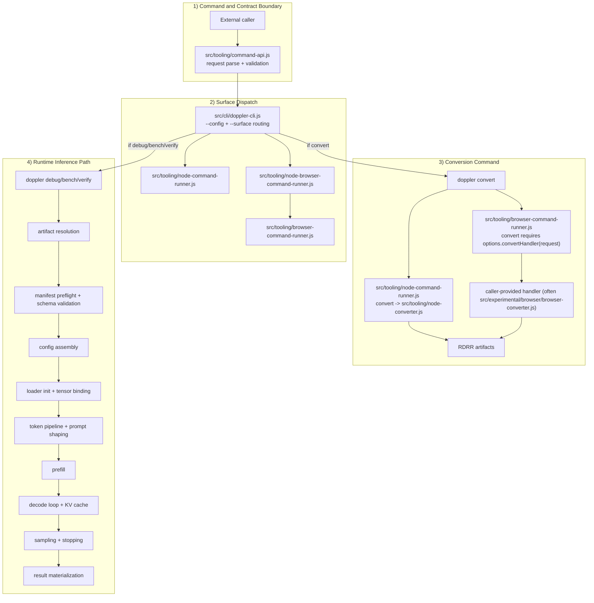

# Pipeline Contract and Implementation Boundaries

Contract-first view of Doppler runtime boundaries.

`src/cli/doppler-cli.js` executes `convert` through the Node path. The browser branch applies
to direct `runBrowserCommand()` usage where `options.convertHandler` is injected by the caller.

## Boundary map

| # | Boundary | Input | Implementation | Output |
| --- | --- | --- | --- | --- |
| 1 | Command normalization | raw CLI/web call | `src/cli/doppler-cli.js`, `src/tooling/command-api.js` | canonical request + intent |
| 2 | Surface dispatch | request + mode | node/browser runners | surface-specific execution |
| 3 | Conversion path | source path + conversion config | Node: `src/tooling/node-converter.js`; Browser: injected `options.convertHandler` (typically wraps `src/experimental/browser/browser-converter.js`) | RDRR artifacts |
| 4 | Artifact resolution | `modelId`/`modelUrl` | storage tooling | manifest URI + shard source |
| 5 | Config merge | manifest + runtime override | `src/config/**` | resolved config |
| 6 | Model loading | resolved manifest/config | `src/loader/**` | GPU-ready tensors + cache state |
| 7 | Prompt shaping | prompt + tokenizer config | `src/inference/**` | token ids + generation options |
| 8 | Prefill | prompt tokens + empty KV | text pipeline steps | seeded KV + first logits |
| 9 | Decode step | current state + step options | text pipeline loop | next token + updated state |
| 10 | Output materialization | stream + traces | command handlers | response + metadata |

## Plane interpretation

- JSON plane: contract and policy (`manifest`, config assets, rule assets)
- JS plane: orchestration and validation
- WGSL plane: deterministic arithmetic only

This is a pipeline-local summary. The normative execution-plane contract lives
in [`style/general-style-guide.md`](style/general-style-guide.md).

Any unresolved selection path is a contract error before dispatch.

## Related

- System model: [architecture.md](architecture.md)
- Inference implementation details: [../src/inference/README.md](../src/inference/README.md)
- Format contracts: [rdrr-format.md](rdrr-format.md)
