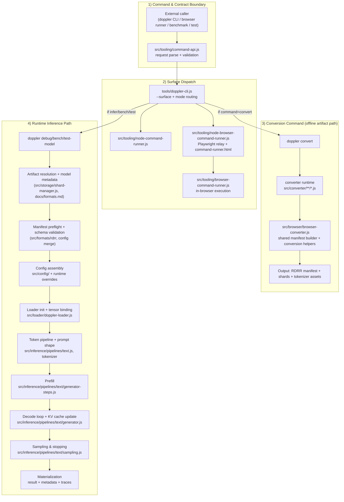

# Pipeline Contract and Implementation Boundaries

This is a top-down, contract-first view of Doppler’s **actual** pipelines.
It is intentionally not force-fitted to any arbitrary fixed number of steps; each
boundary is only where input/output semantics change.

## Boundary Map (I/O + Implementation)

| # | Boundary | Input | Implementation (main) | Output |
|---|---|---|---|---|
| 1 | Command normalization | Raw CLI/web call, flags | `tools/doppler-cli.js`, `src/tooling/command-api.js` | Canonical request + runtime intent |
| 2 | Surface dispatch | Canonical request + mode | `src/tooling/node-command-runner.js`, `src/tooling/node-browser-command-runner.js`, `src/tooling/browser-command-runner.js` | Surface-specific execution |
| 3 | Conversion preflight | Source path + converter config | `src/converter/*.js`, `src/browser/browser-converter.js` | RDRR artifact set (manifest + shards) |
| 4 | Artifact resolution | `modelId`/`modelUrl` + runtime intent | `tools/doppler-cli.js`, `src/storage/shard-manager.js` | Manifest URI + shard/cached assets |
| 5 | Manifest/config contract merge | Manifest + config overrides | `src/config/**/*.js`, `src/config/runtime.js` | Resolved config with source metadata |
| 6 | Model loading | Resolved manifest + config | `src/loader/doppler-loader.js`, `src/formats/rdrr` | GPU-ready weights + kv/tensor locations |
| 7 | Prompt shaping | Raw prompt + tokenizer config | `src/inference/tokenizer.js`, `src/inference/pipelines/text/*.js` | Token IDs + generation options |
| 8 | Prefill | Full prompt token sequence + KV-empty state | `src/inference/pipelines/text/generator-steps.js` | Seeded KV cache + first logits |
| 9 | Decode step | Prefill state + step options | `src/inference/pipelines/text/generator.js`, `src/inference/pipelines/text/layer.js` | Next token + updated cache/state |
| 10 | Output materialization | Stream + trace metadata | CLI/test/bench handlers + debug trace modules | Final response JSON/text + perf/safety metadata |

## Why this map is honest to current behavior

- Conversion is not in the inference loop; it is a separate command path that produces
  artifacts consumed later.
- Loader and inference are separated by contract boundaries (request -> artifact ->
  merged config -> loaded tensors -> execution).
- There is a single runtime contract across browser/node runners; surface differences are
  dispatch/transport details, not separate semantics.
- Prefill and decode share kernel modules but differ in attention/cache behavior and
  prompt-length assumptions.

## Plane Interpretation

- **JSON plane**: manifests, presets, and rule assets define supported command and inference policies.
- **JS plane**: command normalization, config merge/validation, resource allocation, dispatch orchestration.
- **WGSL plane**: deterministic arithmetic kernels only, driven by resolved dispatch parameters.

The contract is strict: if a selection path is missing (kernel path, dtype mode, or runtime
policy), fail before dispatch; never synthesize behavior by JS or WGSL fallback.

## Current Findings (Conversion + Direct-Source Modes)

By severity:

1. **High:** Conversion is still CPU-first; Doppler WebGPU kernels are not used during convert.
   - Convert runs before Node WebGPU runtime path (`src/tooling/node-command-runner.js:62`).
   - Tensor transform/quantization are JS loops (`src/converter/core.js:439`, `src/converter/quantizer.js:210`).
2. **High:** Inference runtime is manifest+shard (RDRR) contract today, not direct SafeTensors/GGUF contract.
   - Manifest-first enforcement is explicit (`src/inference/pipelines/text/config.js:383`).
   - Harness loads `manifest.json` directly (`src/inference/test-harness.js:228`).
3. **Medium:** Doppler GPU kernels/pipelines are used heavily at load/inference time, but only after RDRR is present.
   - Loader tensor upload/transform path (`src/loader/tensor-loader.js:331`).
   - Large-tensor stream-to-GPU upload exists for stored shards (`src/loader/doppler-loader.js:734`).
4. **Medium:** Direct-source mode is feasible with existing primitives, but there are hard gaps.
   - Feasible hooks: `setCustomShardLoader` + `setManifest` (`src/loader/doppler-loader.js:199`, `src/loader/doppler-loader.js:251`), used by runtime init (`src/inference/pipelines/text/init.js:514`).
   - Gap: custom loader lacks true range API (full-shard load then slice) (`src/loader/shard-cache.js:154`).
   - Gap: stream-to-GPU is disabled when custom loader is active (`src/loader/doppler-loader.js:721`).
5. **Medium:** "Source-in-VRAM inference" is realistic only for supported dtypes/paths (not all GGUF quant types).
   - Current loader dispatch is focused on Q4_K/Q6_K/BF16/F16/F32 families (`src/rules/loader/tensor-loader.rules.json:2`).

## Completion Targets (Three Things)

1. **GPU-accelerated conversion path (Node + Browser):**
   - Move heavy conversion hot loops (dtype transform + quantize + shard assembly) onto WebGPU pipelines where supported.
   - Keep deterministic CPU fallback and parity checks as contract requirements.
2. **Direct-source streaming mode (`SafeTensors/GGUF -> RDRR-like runtime view`):**
   - Add true range reads for custom loaders.
   - Re-enable/extend stream-to-GPU for custom loader mode.
3. **Direct-source inference mode (`SafeTensors/GGUF -> VRAM` without persisted RDRR artifacts):**
   - Define explicit source-manifest contract that maps source tensors to runtime loader semantics.
   - Gate by supported dtype/kernel-path matrix and fail fast on unsupported GGUF quant variants.
